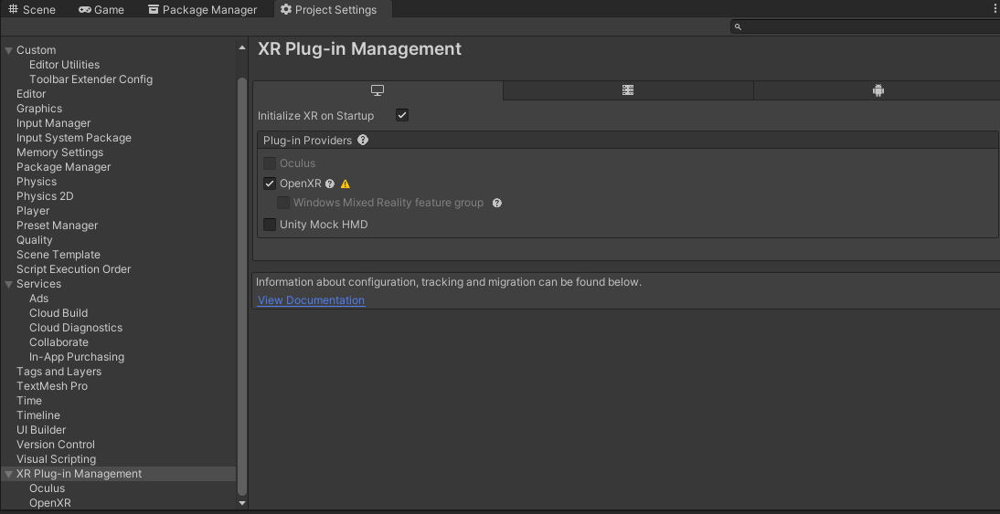
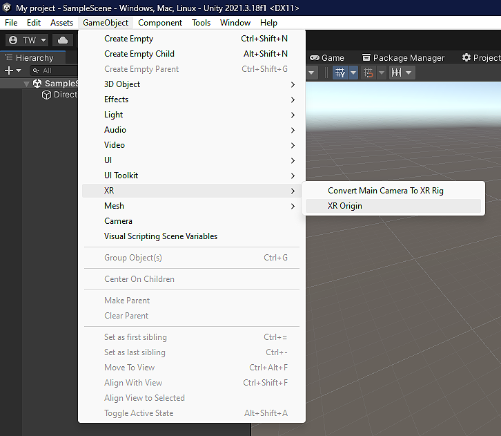

# Table of contents
1. [Overview](#overview) 
2. [Package Contents](#package-contents)
3. [Required packages](#required-packages)
4. [Installation guide](#installation-guide)
5. [Scene setup](#scene-setup)

# Overview
The main features of the Grapple core package are: 
- Adapted Hand and joint tracking through the XRHands package
- Hand visualization
- Gesture recognition

# Package contents
- Script features
	- Custom attributes
	- Joint manager
	- Gesture Recognizer
	- Hand Visualizer
	- Unity type extension methods
- Materials
	- A simple default material for the hands
- Prefabs
	- A default input map for the gesture recognizer
- Third party models
	- Left and Right hand models from the XRHands package
	
# Required packages
Grapple Core relies on the **XRHands** package from Unity. To use this package requires a provider plug-in package that defines a hand provider. Install your desired plugin(s) by going to **Project settings -> XR plug-in Management** or from the package manager.

All dependencies:
- XRHands : 1.1.0
- Rhinox lightspeed: 1.5.3
- Rhinox Utilities: 1.5.2
- Rhinox GUIUtils 2.6.0
- Newtonsoft JSON: 3.1.0
- Json.NET Converters of Unity types by jilleJr: 1.5.0 

# Installation guide
1. Open the project in which to install this package.
2. Import the grapple 2.0 package and its dependencies.
3. Install the target VR plugin(s) (i.e. Oculus) and its packages
4. Set the Plug in provider to OpenXR and install its packages

5. Open the OpenXR submenu and set the correct interaction profile for your target architecture and enable the *Hand Tracking Subsystem* feature group.
6. If developing for Oculus: also enable the *Meta* feature groups.

# Scene setup
There is one necessary GameObject to have in each hand-tracking XR scene in your app: an **XR Origin**.
The XR Origin GameObject enables device tracking and transforms trackables into Unity's coordinate system. If this GameObject is not present in the scene, XR will not function properly.
To create the XR origin, select **GameObject -> XR -> XR Origin**

On the **XR Origin** GameObject, add the **GRPL Joint Manager** and **GRPL Hand Visualizer**.

In the **GRPL Hand Visualizer** component, set the left and right hand prefab to the provided prefabs in **Grapple2.0 -> Prefabs -> Models**. Set the Hand Material to the provided DefaultHandsMaterial that can be found in Grapple2.0 -> Prefabs -> Materials.

All that’s left is to link your VR device (that supports hand tracking) and press play mode, then your hand should get tracked and visualized. 

