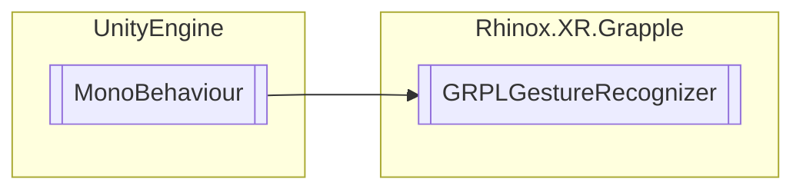

# GRPLGestureRecognizer `Public class`

## Description

This class implements the behaviour to detect gestures. These gestures can be imported from a json or recording during
play mode.
There is also the possibility to export the gestures in a (new) json file.

## Diagram



## Members

### Properties

#### Public  properties

| Type                                                  | Name                                                                                                                                                                                             | Methods            |
|-------------------------------------------------------|--------------------------------------------------------------------------------------------------------------------------------------------------------------------------------------------------|--------------------|
| [`RhinoxGesture`](./rhinoxxrgrapple-RhinoxGesture) | [`CurrentLeftGesture`](#currentleftgesture)<br>A RhinoxGesture object that represents the current gesture of the left hand.                                                                      | `get`              |
| [`RhinoxGesture`](./rhinoxxrgrapple-RhinoxGesture) | [`CurrentRightGesture`](#currentrightgesture)<br>A RhinoxGesture object that represents the current gesture of the right hand.                                                                   | `get`              |
| `bool`                                                | [`LeftHandGestureRecognizedThisFrame`](#lefthandgesturerecognizedthisframe)<br>A boolean flag that indicates whether a gesture was recognized for the first time this frame on the left hand.    | `get, private set` |
| `bool`                                                | [`RightHandGestureRecognizedThisFrame`](#righthandgesturerecognizedthisframe)<br>A boolean flag that indicates whether a gesture was recognized for the first time this frame on the right hand. | `get, private set` |

### Methods

#### Public  methods

| Returns                                               | Name                                                                                                                                                                                                                                                                                                     |
|-------------------------------------------------------|----------------------------------------------------------------------------------------------------------------------------------------------------------------------------------------------------------------------------------------------------------------------------------------------------------|
| [`RhinoxGesture`](./rhinoxxrgrapple-RhinoxGesture) | [`GetCurrentGestureOfHand`](#getcurrentgestureofhand)([`RhinoxHand`](./rhinoxxrgrapple-RhinoxHand) hand)<br>Returns the current gesture on the given hand if the hand is either left or right. <br>            Returns null if the given hand is invalid.                                             |
| `void`                                                | [`ReadGesturesFromJson`](#readgesturesfromjson)(`string` path)<br>Imports the gestures from the given json file at path "path". If the directory or file is not valid, an empty list is added. Specify whether to overwrite the current gesture using "OverwriteGesturesOnImport"                        |
| `bool`                                                | [`WasRecognizedGestureStartedThisFrame`](#wasrecognizedgesturestartedthisframe)([`RhinoxHand`](./rhinoxxrgrapple-RhinoxHand) hand)<br>Returns whether the current gesture on the given hand was recognized for the first time this frame. <br>            Returns false if the given hand is invalid. |
| `void`                                                | [`WriteGesturesToJson`](#writegesturestojson)()<br>Writes all current gestures to a .json file at directory "ExportFilePath" with name "ExportFileName".json. If the ExportFilePath directory is not valid, the application data path is used.                                                           |

## Details

### Summary

This class implements the behaviour to detect gestures. These gestures can be imported from a json or recording during
play mode.
There is also the possibility to export the gestures in a (new) json file.

### Inheritance

- `MonoBehaviour`

### Constructors

#### GRPLGestureRecognizer

```csharp
public GRPLGestureRecognizer()
```

### Methods

#### GetCurrentGestureOfHand

```csharp
public RhinoxGesture GetCurrentGestureOfHand(RhinoxHand hand)
```

##### Arguments

| Type                                            | Name | Description |
|-------------------------------------------------|------|-------------|
| [`RhinoxHand`](./rhinoxxrgrapple-RhinoxHand) | hand |             |

##### Summary

Returns the current gesture on the given hand if the hand is either left or right.
Returns null if the given hand is invalid.

##### Returns

The gesture on hand.

#### WasRecognizedGestureStartedThisFrame

```csharp
public bool WasRecognizedGestureStartedThisFrame(RhinoxHand hand)
```

##### Arguments

| Type                                            | Name | Description |
|-------------------------------------------------|------|-------------|
| [`RhinoxHand`](./rhinoxxrgrapple-RhinoxHand) | hand |             |

##### Summary

Returns whether the current gesture on the given hand was recognized for the first time this frame.
Returns false if the given hand is invalid.

##### Returns

Whether the current gesture on the given hand was recognized for the first time this frame.

#### WriteGesturesToJson

```csharp
public void WriteGesturesToJson()
```

##### Summary

Writes all current gestures to a .json file at directory "ExportFilePath" with name "ExportFileName".json. If the
ExportFilePath directory is not valid, the application data path is used.

#### ReadGesturesFromJson

```csharp
public void ReadGesturesFromJson(string path)
```

##### Arguments

| Type     | Name | Description |
|----------|------|-------------|
| `string` | path |             |

##### Summary

Imports the gestures from the given json file at path "path". If the directory or file is not valid, an empty list is
added. Specify whether to overwrite the current gesture using "OverwriteGesturesOnImport"

### Properties

#### CurrentLeftGesture

```csharp
public RhinoxGesture CurrentLeftGesture { get; }
```

##### Summary

A RhinoxGesture object that represents the current gesture of the left hand.

#### CurrentRightGesture

```csharp
public RhinoxGesture CurrentRightGesture { get; }
```

##### Summary

A RhinoxGesture object that represents the current gesture of the right hand.

#### LeftHandGestureRecognizedThisFrame

```csharp
public bool LeftHandGestureRecognizedThisFrame { get; private set; }
```

##### Summary

A boolean flag that indicates whether a gesture was recognized for the first time this frame on the left hand.

#### RightHandGestureRecognizedThisFrame

```csharp
public bool RightHandGestureRecognizedThisFrame { get; private set; }
```

##### Summary

A boolean flag that indicates whether a gesture was recognized for the first time this frame on the right hand.

### Events

#### GlobalInitialized

```csharp
public static event Action<GRPLGestureRecognizer> GlobalInitialized
```

*Generated with* [*ModularDoc*](https://github.com/hailstorm75/ModularDoc)
