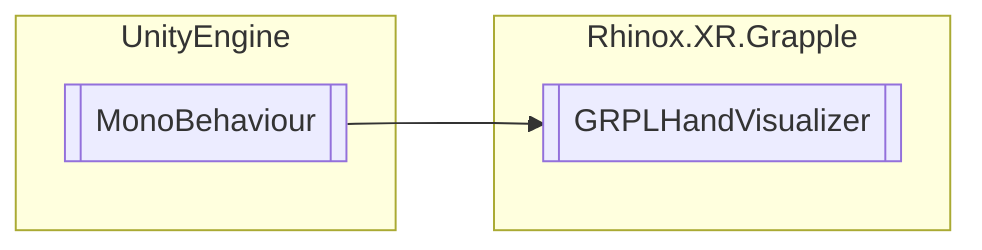

# GRPLHandVisualizer `Public class`

## Description

Visualizes the hands with the given prefabs.

## Diagram



## Members

### Properties

#### Public  properties

| Type                  | Name                                                                                                                   | Methods |
|-----------------------|------------------------------------------------------------------------------------------------------------------------|---------|
| `Material`            | [`HandMaterial`](#handmaterial)<br>Returns the material used for the hand prefabs.                                     | `get`   |
| `SkinnedMeshRenderer` | [`LeftHandRenderer`](#lefthandrenderer)<br>Returns the store reference to the SkinnedMeshRenderer of the left hand.    | `get`   |
| `SkinnedMeshRenderer` | [`RightHandRenderer`](#righthandrenderer)<br>Returns the store reference to the SkinnedMeshRenderer of the right hand. | `get`   |

## Details

### Summary

Visualizes the hands with the given prefabs.

### Inheritance

- `MonoBehaviour`

### Constructors

#### GRPLHandVisualizer

```csharp
public GRPLHandVisualizer()
```

### Properties

#### HandMaterial

```csharp
public Material HandMaterial { get; }
```

##### Summary

Returns the material used for the hand prefabs.

#### LeftHandRenderer

```csharp
public SkinnedMeshRenderer LeftHandRenderer { get; }
```

##### Summary

Returns the store reference to the SkinnedMeshRenderer of the left hand.

#### RightHandRenderer

```csharp
public SkinnedMeshRenderer RightHandRenderer { get; }
```

##### Summary

Returns the store reference to the SkinnedMeshRenderer of the right hand.

*Generated with* [*ModularDoc*](https://github.com/hailstorm75/ModularDoc)
