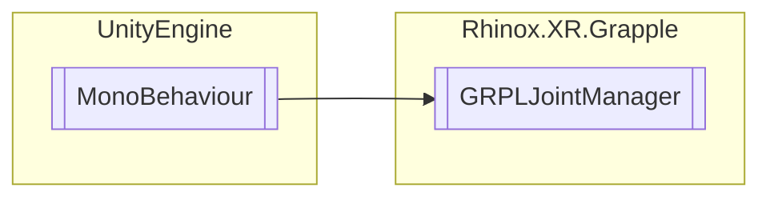

# GRPLJointManager `Public class`

## Description

Takes the Joint data from XRHandSubsystem and maps them to our own [RhinoxJoint](./rhinoxxrgrapple-RhinoxJoint)
structure. This manager also supplies and updates Capsule colliders with
rigidbodies [RhinoxJointCapsule](./rhinoxxrgrapple-RhinoxJointCapsule) . This manager also relays events from the
XRHandSubsystem when tracking is either lost or acquired.

## Diagram



## Members

### Properties

#### Public  properties

| Type                                                                | Name                                                                                                                                                                                                                                       | Methods            |
|---------------------------------------------------------------------|--------------------------------------------------------------------------------------------------------------------------------------------------------------------------------------------------------------------------------------------|--------------------|
| `bool`                                                              | [`AreJointsInitialised`](#arejointsinitialised)<br>A boolean variable that indicates if the joints are initialized.                                                                                                                        | `get, private set` |
| `bool`                                                              | [`IsLeftHandTracked`](#islefthandtracked)<br>A boolean variable that indicates if the left hand is being tracked.                                                                                                                          | `get, private set` |
| `bool`                                                              | [`IsRightHandTracked`](#isrighthandtracked)<br>A boolean variable that indicates if the right hand is being tracked.                                                                                                                       | `get, private set` |
| `bool`                                                              | [`JointCollisionsEnabled`](#jointcollisionsenabled)<br>A boolean property that gets or sets the value of _jointCollisionsEnabled.<br>            When this value is set, it also sets the collisions of the hands with the joint capsules. | `get, set`         |
| [`RhinoxJointCapsule`](./rhinoxxrgrapple-RhinoxJointCapsule)`[]` | [`LeftHandCapsules`](#lefthandcapsules)<br>An array of RhinoxJointCapsule objects that represent the joint capsules of the left hand.                                                                                                      | `get`              |
| `GameObject`                                                        | [`LeftHandParentObj`](#lefthandparentobj)<br>A GameObject variable that represents the parent object of the left hand.                                                                                                                     | `get`              |
| `GameObject`                                                        | [`LeftHandSocket`](#lefthandsocket)<br>A GameObject variable that represents the socket used to attach objects to the left hand.                                                                                                           | `get`              |
| [`RhinoxJointCapsule`](./rhinoxxrgrapple-RhinoxJointCapsule)`[]` | [`RightHandCapsules`](#righthandcapsules)<br>An array of RhinoxJointCapsule objects that represent the joint capsules of the right hand.                                                                                                   | `get`              |
| `GameObject`                                                        | [`RightHandParentObj`](#righthandparentobj)<br>A GameObject variable that represents the parent object of the right hand.                                                                                                                  | `get`              |
| `GameObject`                                                        | [`RightHandSocket`](#righthandsocket)<br>A GameObject variable that represents the socket used to attach objects to the right hand.                                                                                                        | `get`              |

### Methods

#### Public  methods

| Returns                                                                | Name                                                                                                                                                                                                                                                                                                                                   |
|------------------------------------------------------------------------|----------------------------------------------------------------------------------------------------------------------------------------------------------------------------------------------------------------------------------------------------------------------------------------------------------------------------------------|
| `void`                                                                 | [`DisableHandCollisions`](#disablehandcollisions)([`RhinoxHand`](./rhinoxxrgrapple-RhinoxHand) hand)<br>This method enables collisions for the hand specified by the RhinoxHand parameter.<br>            It internally calls the method SetHandCollisions with a false value for the state parameter and the specified RhinoxHand. |
| `void`                                                                 | [`DisableHandCollisionsAfterDelay`](#disablehandcollisionsafterdelay)([`RhinoxHand`](./rhinoxxrgrapple-RhinoxHand) hand)                                                                                                                                                                                                            |
| `void`                                                                 | [`EnableHandCollisions`](#enablehandcollisions)([`RhinoxHand`](./rhinoxxrgrapple-RhinoxHand) hand)<br>This method enables collisions for the hand specified by the RhinoxHand parameter.<br>            It internally calls the method SetHandCollisions with a true value for the state parameter and the specified RhinoxHand.    |
| `void`                                                                 | [`EnableHandCollisionsAfterDelay`](#enablehandcollisionsafterdelay)([`RhinoxHand`](./rhinoxxrgrapple-RhinoxHand) hand)                                                                                                                                                                                                              |
| `ICollection`&lt;[`RhinoxJoint`](./rhinoxxrgrapple-RhinoxJoint)&gt; | [`GetJointsFromBothHand`](#getjointsfrombothhand)(`XRHandJointID` jointID)<br>Gets all joints with XRHandJointID "jointID" from both hands.                                                                                                                                                                                            |
| `void`                                                                 | [`SetHandCollisions`](#sethandcollisions)(`bool` state, [`RhinoxHand`](./rhinoxxrgrapple-RhinoxHand) hand)                                                                                                                                                                                                                          |
| `bool`                                                                 | [`TryGetFingerBend`](#trygetfingerbend)([`RhinoxHand`](./rhinoxxrgrapple-RhinoxHand) hand, [`RhinoxFinger`](./rhinoxxrgrapple-RhinoxFinger) finger, out `float` bendValue, `bool` remap)                                                                                                                                         |
| `bool`                                                                 | [`TryGetJointFromHandById`](#trygetjointfromhandbyid)(`XRHandJointID` jointID, [`RhinoxHand`](./rhinoxxrgrapple-RhinoxHand) rhinoxHand, out [`RhinoxJoint`](./rhinoxxrgrapple-RhinoxJoint) joint)                                                                                                                                |
| `bool`                                                                 | [`TryGetJointsFromHand`](#trygetjointsfromhand)([`RhinoxHand`](./rhinoxxrgrapple-RhinoxHand) rhinoxHand, out `List`&lt;[`RhinoxJoint`](./rhinoxxrgrapple-RhinoxJoint)&gt; jointList)                                                                                                                                             |

## Details

### Summary

Takes the Joint data from XRHandSubsystem and maps them to our own [RhinoxJoint](./rhinoxxrgrapple-RhinoxJoint)
structure. This manager also supplies and updates Capsule colliders with
rigidbodies [RhinoxJointCapsule](./rhinoxxrgrapple-RhinoxJointCapsule) . This manager also relays events from the
XRHandSubsystem when tracking is either lost or acquired.

### Remarks

Almost all classes in the Interaction Toolkit rely on this jointManager to function

### Inheritance

- `MonoBehaviour`

### Constructors

#### GRPLJointManager

```csharp
public GRPLJointManager()
```

### Methods

#### EnableHandCollisions

```csharp
public void EnableHandCollisions(RhinoxHand hand)
```

##### Arguments

| Type                                            | Name | Description                   |
|-------------------------------------------------|------|-------------------------------|
| [`RhinoxHand`](./rhinoxxrgrapple-RhinoxHand) | hand | Hand to enable collisions on. |

##### Summary

This method enables collisions for the hand specified by the RhinoxHand parameter.
It internally calls the method SetHandCollisions with a true value for the state parameter and the specified RhinoxHand.

#### DisableHandCollisions

```csharp
public void DisableHandCollisions(RhinoxHand hand)
```

##### Arguments

| Type                                            | Name | Description                    |
|-------------------------------------------------|------|--------------------------------|
| [`RhinoxHand`](./rhinoxxrgrapple-RhinoxHand) | hand | Hand to disable collisions on. |

##### Summary

This method enables collisions for the hand specified by the RhinoxHand parameter.
It internally calls the method SetHandCollisions with a false value for the state parameter and the specified
RhinoxHand.

#### EnableHandCollisionsAfterDelay

```csharp
public void EnableHandCollisionsAfterDelay(RhinoxHand hand)
```

##### Arguments

| Type                                            | Name | Description |
|-------------------------------------------------|------|-------------|
| [`RhinoxHand`](./rhinoxxrgrapple-RhinoxHand) | hand |             |

#### DisableHandCollisionsAfterDelay

```csharp
public void DisableHandCollisionsAfterDelay(RhinoxHand hand)
```

##### Arguments

| Type                                            | Name | Description |
|-------------------------------------------------|------|-------------|
| [`RhinoxHand`](./rhinoxxrgrapple-RhinoxHand) | hand |             |

#### SetHandCollisions

```csharp
public void SetHandCollisions(bool state, RhinoxHand hand)
```

##### Arguments

| Type                                            | Name  | Description |
|-------------------------------------------------|-------|-------------|
| `bool`                                          | state |             |
| [`RhinoxHand`](./rhinoxxrgrapple-RhinoxHand) | hand  |             |

#### TryGetJointsFromHand

```csharp
public bool TryGetJointsFromHand(RhinoxHand rhinoxHand, out List<RhinoxJoint> jointList)
```

##### Arguments

| Type                                                                  | Name       | Description |
|-----------------------------------------------------------------------|------------|-------------|
| [`RhinoxHand`](./rhinoxxrgrapple-RhinoxHand)                       | rhinoxHand |             |
| `out` `List`&lt;[`RhinoxJoint`](./rhinoxxrgrapple-RhinoxJoint)&gt; | jointList  |             |

#### TryGetJointFromHandById

```csharp
public bool TryGetJointFromHandById(XRHandJointID jointID, RhinoxHand rhinoxHand, out RhinoxJoint joint)
```

##### Arguments

| Type                                                    | Name       | Description |
|---------------------------------------------------------|------------|-------------|
| `XRHandJointID`                                         | jointID    |             |
| [`RhinoxHand`](./rhinoxxrgrapple-RhinoxHand)         | rhinoxHand |             |
| `out` [`RhinoxJoint`](./rhinoxxrgrapple-RhinoxJoint) | joint      |             |

#### TryGetFingerBend

```csharp
public bool TryGetFingerBend(RhinoxHand hand, RhinoxFinger finger, out float bendValue, bool remap)
```

##### Arguments

| Type                                                | Name      | Description |
|-----------------------------------------------------|-----------|-------------|
| [`RhinoxHand`](./rhinoxxrgrapple-RhinoxHand)     | hand      |             |
| [`RhinoxFinger`](./rhinoxxrgrapple-RhinoxFinger) | finger    |             |
| `out` `float`                                       | bendValue |             |
| `bool`                                              | remap     |             |

#### GetJointsFromBothHand

```csharp
public ICollection<RhinoxJoint> GetJointsFromBothHand(XRHandJointID jointID)
```

##### Arguments

| Type            | Name    | Description          |
|-----------------|---------|----------------------|
| `XRHandJointID` | jointID | The desired joint ID |

##### Summary

Gets all joints with XRHandJointID "jointID" from both hands.

##### Returns

An ICollection holding all the RhinoxJoints corresponding with jointID

### Properties

#### IsLeftHandTracked

```csharp
public bool IsLeftHandTracked { get; private set; }
```

##### Summary

A boolean variable that indicates if the left hand is being tracked.

#### IsRightHandTracked

```csharp
public bool IsRightHandTracked { get; private set; }
```

##### Summary

A boolean variable that indicates if the right hand is being tracked.

#### AreJointsInitialised

```csharp
public bool AreJointsInitialised { get; private set; }
```

##### Summary

A boolean variable that indicates if the joints are initialized.

#### JointCollisionsEnabled

```csharp
public bool JointCollisionsEnabled { get; set; }
```

##### Summary

A boolean property that gets or sets the value of _jointCollisionsEnabled.
When this value is set, it also sets the collisions of the hands with the joint capsules.

#### LeftHandCapsules

```csharp
public RhinoxJointCapsule LeftHandCapsules { get; }
```

##### Summary

An array of RhinoxJointCapsule objects that represent the joint capsules of the left hand.

#### RightHandCapsules

```csharp
public RhinoxJointCapsule RightHandCapsules { get; }
```

##### Summary

An array of RhinoxJointCapsule objects that represent the joint capsules of the right hand.

#### LeftHandParentObj

```csharp
public GameObject LeftHandParentObj { get; }
```

##### Summary

A GameObject variable that represents the parent object of the left hand.

#### LeftHandSocket

```csharp
public GameObject LeftHandSocket { get; }
```

##### Summary

A GameObject variable that represents the socket used to attach objects to the left hand.

#### RightHandParentObj

```csharp
public GameObject RightHandParentObj { get; }
```

##### Summary

A GameObject variable that represents the parent object of the right hand.

#### RightHandSocket

```csharp
public GameObject RightHandSocket { get; }
```

##### Summary

A GameObject variable that represents the socket used to attach objects to the right hand.

### Events

#### GlobalInitialized

```csharp
public static event Action<GRPLJointManager> GlobalInitialized
```

##### Summary

A static event that is triggered when the GRPLJointManager is initialized globally, which passes itself as a parameter.

#### TrackingAcquired

```csharp
public event Action<RhinoxHand> TrackingAcquired
```

##### Summary

An event that is triggered when tracking is acquired for a hand.

#### TrackingLost

```csharp
public event Action<RhinoxHand> TrackingLost
```

##### Summary

An event that is triggered when tracking is lost for a hand.

#### OnHandsUpdated

```csharp
public event Action<RhinoxHand> OnHandsUpdated
```

##### Summary

An event that is triggered when a hand is updated.

#### OnJointCapsulesInitialized

```csharp
public event Action<RhinoxHand> OnJointCapsulesInitialized
```

##### Summary

An event that is triggered when the joint capsules are initialized.

#### Initialized

```csharp
private event Action Initialized
```

*Generated with* [*ModularDoc*](https://github.com/hailstorm75/ModularDoc)
