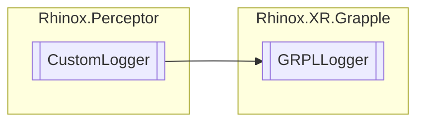

# GRPLLogger `Internal class`

## Description

This empty class gets used in combination with the Rhinox.Perceptor for custom logging behavior.

## Diagram



## Details

### Summary

This empty class gets used in combination with the Rhinox.Perceptor for custom logging behavior.

### Inheritance

- `CustomLogger`

### Constructors

#### GRPLLogger

```csharp
public GRPLLogger()
```

*Generated with* [*ModularDoc*](https://github.com/hailstorm75/ModularDoc)
