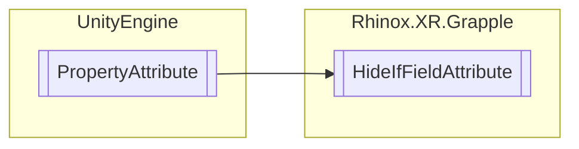

# HideIfFieldAttribute `Public class`

## Description

This attribute class is used in Unity C# scripts to hide a serialized field in the inspector window if a sibling
boolean field with the specified name has a certain value. This can be useful for creating conditional fields
that are only visible when a certain condition is met.

## Diagram



## Details

### Summary

This attribute class is used in Unity C# scripts to hide a serialized field in the inspector window if a sibling
boolean field with the specified name has a certain value. This can be useful for creating conditional fields
that are only visible when a certain condition is met.

### Inheritance

- `PropertyAttribute`

### Constructors

#### HideIfFieldAttribute [1/2]

```csharp
public HideIfFieldAttribute(bool boolState, string fieldName)
```

##### Arguments

| Type     | Name      | Description |
|----------|-----------|-------------|
| `bool`   | boolState |             |
| `string` | fieldName |             |

##### Summary

Creates the attribute and fills the BoolFieldName and BoolState fields.

#### HideIfFieldAttribute [2/2]

```csharp
public HideIfFieldAttribute(bool boolState, string fieldName, float propertyHeight)
```

##### Arguments

| Type     | Name           | Description |
|----------|----------------|-------------|
| `bool`   | boolState      |             |
| `string` | fieldName      |             |
| `float`  | propertyHeight |             |

##### Summary

Creates the attribute and fills the BoolFieldName, BoolState and PropertyHeight fields. Also sets HeightPassed to true.

*Generated with* [*ModularDoc*](https://github.com/hailstorm75/ModularDoc)
