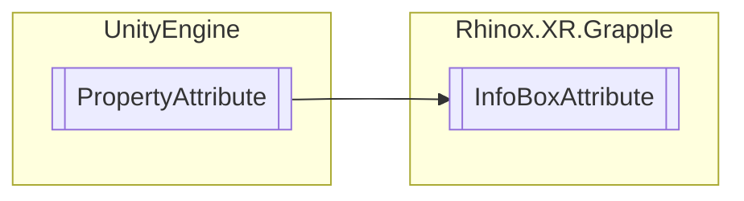

# InfoBoxAttribute `Public class`

## Description

This attribute class is used in Unity C# scripts to display an information box above a field in the inspector
window. The information box can contain a message and a message type, such as info, warning, or error.
This can be useful for providing additional context or warnings about a field.

## Diagram



## Members

### Properties

#### Public  properties

| Type          | Name                                                                                                                        | Methods    |
|---------------|-----------------------------------------------------------------------------------------------------------------------------|------------|
| `string`      | [`Message`](#message)<br>A string containing the message to display in the information box.                                 | `get, set` |
| `MessageType` | [`MessageType`](#messagetype)<br>A MessageType enum value specifying the type of message to display in the information box. | `get, set` |

## Details

### Summary

This attribute class is used in Unity C# scripts to display an information box above a field in the inspector
window. The information box can contain a message and a message type, such as info, warning, or error.
This can be useful for providing additional context or warnings about a field.

### Inheritance

- `PropertyAttribute`

### Constructors

#### InfoBoxAttribute [1/2]

```csharp
public InfoBoxAttribute(string message)
```

##### Arguments

| Type     | Name    | Description             |
|----------|---------|-------------------------|
| `string` | message | The message to display. |

##### Summary

This constructor creates an instance of the InfoBoxAttribute class with the given message and sets the message type to
MessageType.Info.

#### InfoBoxAttribute [2/2]

```csharp
public InfoBoxAttribute(string message, MessageType messageType)
```

##### Arguments

| Type          | Name        | Description               |
|---------------|-------------|---------------------------|
| `string`      | message     | The message to display.   |
| `MessageType` | messageType | The desired message type. |

##### Summary

This constructor creates an instance of the InfoBoxAttribute class with the given message and message type.

### Properties

#### Message

```csharp
public string Message { get; set; }
```

##### Summary

A string containing the message to display in the information box.

#### MessageType

```csharp
public MessageType MessageType { get; set; }
```

##### Summary

A MessageType enum value specifying the type of message to display in the information box.

*Generated with* [*ModularDoc*](https://github.com/hailstorm75/ModularDoc)
