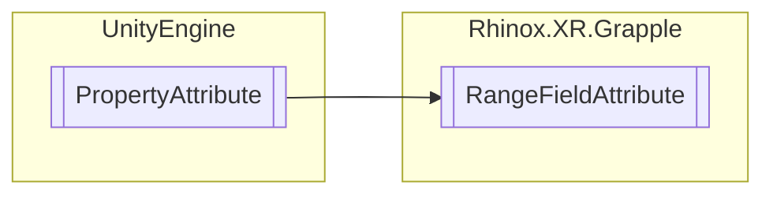

# RangeFieldAttribute `Public class`

## Description

The RangeFieldAttribute is an attribute that can be applied to a field to restrict the minimum value of that
field to the specified value and maximum value to the value of a sibling field.

## Diagram



## Members

### Properties

#### Public  properties

| Type     | Name                                                                                                                | Methods    |
|----------|---------------------------------------------------------------------------------------------------------------------|------------|
| `string` | [`MaxFieldName`](#maxfieldname)<br>A string holding the name of the sibling field to compare for the maximum value. | `get, set` |
| `float`  | [`Min`](#min)<br>A float holding the minimum value for the field.                                                   | `get, set` |

## Details

### Summary

The RangeFieldAttribute is an attribute that can be applied to a field to restrict the minimum value of that
field to the specified value and maximum value to the value of a sibling field.

### Inheritance

- `PropertyAttribute`

### Constructors

#### RangeFieldAttribute

```csharp
public RangeFieldAttribute(float min, string maxFieldName)
```

##### Arguments

| Type     | Name         | Description                                            |
|----------|--------------|--------------------------------------------------------|
| `float`  | min          | The minimum value.                                     |
| `string` | maxFieldName | The name of the sibling, that holds the maximum value. |

##### Summary

Creates a new RangeFieldAttribute object with the specified minimum value and maximum field name.

### Properties

#### Min

```csharp
public float Min { get; set; }
```

##### Summary

A float holding the minimum value for the field.

#### MaxFieldName

```csharp
public string MaxFieldName { get; set; }
```

##### Summary

A string holding the name of the sibling field to compare for the maximum value.

*Generated with* [*ModularDoc*](https://github.com/hailstorm75/ModularDoc)
