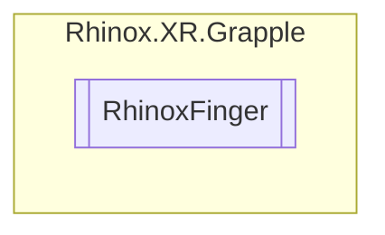

# RhinoxFinger `Public enum`

## Description

Represents the fingers on a hand, including the thumb and four fingers.

## Diagram

## Details

### Summary

Represents the fingers on a hand, including the thumb and four fingers.

### Fields

#### Thumb

##### Summary

The thumb finger.

#### Index

##### Summary

The index finger.

#### Middle

##### Summary

The middle finger.

#### Ring

##### Summary

The ring finger.

#### Little

##### Summary

The little finger (also known as the pinky finger).

*Generated with* [*ModularDoc*](https://github.com/hailstorm75/ModularDoc)
