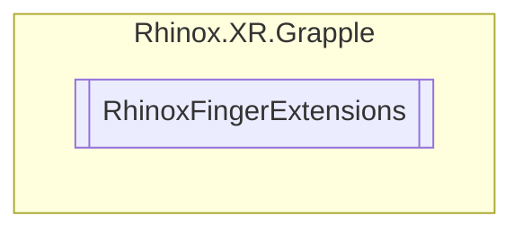

# RhinoxFingerExtensions `Public class`

## Diagram



## Members

### Methods

#### Public Static methods

| Returns                              | Name                                                                                                                                                                                                                         |
|--------------------------------------|------------------------------------------------------------------------------------------------------------------------------------------------------------------------------------------------------------------------------|
| `ICollection`&lt;`XRHandJointID`&gt; | [`GetJointIdsFromFinger`](#getjointidsfromfinger)([`RhinoxFinger`](./rhinoxxrgrapple-RhinoxFinger) finger)<br>This extension method retrieves all the XRHandJointIds that correspond to the joints of a specified finger. |

## Details

### Methods

#### GetJointIdsFromFinger

```csharp
public static ICollection<XRHandJointID> GetJointIdsFromFinger(RhinoxFinger finger)
```

##### Arguments

| Type                                                | Name   | Description                                             |
|-----------------------------------------------------|--------|---------------------------------------------------------|
| [`RhinoxFinger`](./rhinoxxrgrapple-RhinoxFinger) | finger | The finger for which the joint ids are being retrieved. |

##### Summary

This extension method retrieves all the XRHandJointIds that correspond to the joints of a specified finger.

##### Remarks

If an invalid value is passed for the RhinoxFinger parameter, an empty collection is returned.

##### Returns

A collection of XRHandJointID values that correspond to the joints of the specified finger.

*Generated with* [*ModularDoc*](https://github.com/hailstorm75/ModularDoc)
