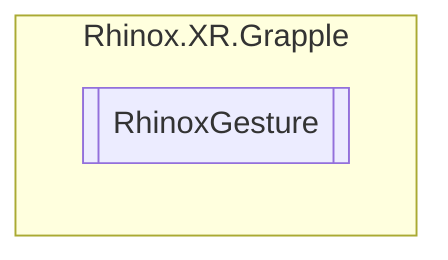

# RhinoxGesture `Public class`

## Description

The RhinoxGesture class represents a gesture in the Rhinox XR Grapple module.
It contains data related to a gesture, such as the name, finger bend values, joint forward,
distance and rotation thresholds, and events that are invoked when the gesture is recognized or unrecognized.

## Diagram



## Members

### Methods

#### Public  methods

| Returns | Name                                                                                                                                                                              |
|---------|-----------------------------------------------------------------------------------------------------------------------------------------------------------------------------------|
| `void`  | [`AddListenerOnRecognized`](#addlisteneronrecognized)(`UnityAction`&lt;[`RhinoxHand`](./rhinoxxrgrapple-RhinoxHand)&gt; action)                                                |
| `void`  | [`AddListenerOnUnRecognized`](#addlisteneronunrecognized)(`UnityAction`&lt;[`RhinoxHand`](./rhinoxxrgrapple-RhinoxHand)&gt; action)                                            |
| `bool`  | [`Equals`](#equals-12)(`...`)                                                                                                                                                     |
| `int`   | [`GetHashCode`](#gethashcode)()                                                                                                                                                   |
| `void`  | [`InvokeOnRecognized`](#invokeonrecognized)([`RhinoxHand`](./rhinoxxrgrapple-RhinoxHand) hand)<br>Invokes the OnRecognized event with the provided RhinoxHand parameter.       |
| `void`  | [`InvokeOnUnRecognized`](#invokeonunrecognized)([`RhinoxHand`](./rhinoxxrgrapple-RhinoxHand) hand)<br>Invokes the OnUnrecognized event with the provided RhinoxHand parameter. |
| `void`  | [`RemoveAllListenersOnRecognized`](#removealllistenersonrecognized)()<br>Removes all listeners from the OnRecognized event.                                                       |
| `void`  | [`RemoveAllListenersOnUnRecognized`](#removealllistenersonunrecognized)()<br>Removes all listeners from the OnUnrecognized event.                                                 |
| `void`  | [`RemoveListenerOnRecognized`](#removelisteneronrecognized)(`UnityAction`&lt;[`RhinoxHand`](./rhinoxxrgrapple-RhinoxHand)&gt; action)                                          |
| `void`  | [`RemoveListenerOnUnRecognized`](#removelisteneronunrecognized)(`UnityAction`&lt;[`RhinoxHand`](./rhinoxxrgrapple-RhinoxHand)&gt; action)                                      |

#### Public Static methods

| Returns                                             | Name                                                                                                                                                          |
|-----------------------------------------------------|---------------------------------------------------------------------------------------------------------------------------------------------------------------|
| `bool`                                              | `operator` [`!=`](#operator-)([`RhinoxGesture`](rhinoxxrgrapple-RhinoxGesture) obj1, [`RhinoxGesture`](rhinoxxrgrapple-RhinoxGesture) obj2)             |
| `bool`                                              | `operator` [`==`](#operator-)([`RhinoxGesture`](rhinoxxrgrapple-RhinoxGesture) gestureOne, [`RhinoxGesture`](rhinoxxrgrapple-RhinoxGesture) gestureTwo) |
| [`RhinoxGesture`](rhinoxxrgrapple-RhinoxGesture) | [`NoGesture`](#nogesture)()<br>Returns an instance of RhinoxGesture with default values, representing the absence of a gesture.                               |

## Details

### Summary

The RhinoxGesture class represents a gesture in the Rhinox XR Grapple module.
It contains data related to a gesture, such as the name, finger bend values, joint forward,
distance and rotation thresholds, and events that are invoked when the gesture is recognized or unrecognized.

### Constructors

#### RhinoxGesture

```csharp
public RhinoxGesture()
```

### Methods

#### AddListenerOnRecognized

```csharp
public void AddListenerOnRecognized(UnityAction<RhinoxHand> action)
```

##### Arguments

| Type                                                                 | Name   | Description |
|----------------------------------------------------------------------|--------|-------------|
| `UnityAction`&lt;[`RhinoxHand`](./rhinoxxrgrapple-RhinoxHand)&gt; | action |             |

#### RemoveListenerOnRecognized

```csharp
public void RemoveListenerOnRecognized(UnityAction<RhinoxHand> action)
```

##### Arguments

| Type                                                                 | Name   | Description |
|----------------------------------------------------------------------|--------|-------------|
| `UnityAction`&lt;[`RhinoxHand`](./rhinoxxrgrapple-RhinoxHand)&gt; | action |             |

#### RemoveAllListenersOnRecognized

```csharp
public void RemoveAllListenersOnRecognized()
```

##### Summary

Removes all listeners from the OnRecognized event.

#### InvokeOnRecognized

```csharp
public void InvokeOnRecognized(RhinoxHand hand)
```

##### Arguments

| Type                                            | Name | Description |
|-------------------------------------------------|------|-------------|
| [`RhinoxHand`](./rhinoxxrgrapple-RhinoxHand) | hand |             |

##### Summary

Invokes the OnRecognized event with the provided RhinoxHand parameter.

#### AddListenerOnUnRecognized

```csharp
public void AddListenerOnUnRecognized(UnityAction<RhinoxHand> action)
```

##### Arguments

| Type                                                                 | Name   | Description |
|----------------------------------------------------------------------|--------|-------------|
| `UnityAction`&lt;[`RhinoxHand`](./rhinoxxrgrapple-RhinoxHand)&gt; | action |             |

#### RemoveListenerOnUnRecognized

```csharp
public void RemoveListenerOnUnRecognized(UnityAction<RhinoxHand> action)
```

##### Arguments

| Type                                                                 | Name   | Description |
|----------------------------------------------------------------------|--------|-------------|
| `UnityAction`&lt;[`RhinoxHand`](./rhinoxxrgrapple-RhinoxHand)&gt; | action |             |

#### RemoveAllListenersOnUnRecognized

```csharp
public void RemoveAllListenersOnUnRecognized()
```

##### Summary

Removes all listeners from the OnUnrecognized event.

#### InvokeOnUnRecognized

```csharp
public void InvokeOnUnRecognized(RhinoxHand hand)
```

##### Arguments

| Type                                            | Name | Description |
|-------------------------------------------------|------|-------------|
| [`RhinoxHand`](./rhinoxxrgrapple-RhinoxHand) | hand |             |

##### Summary

Invokes the OnUnrecognized event with the provided RhinoxHand parameter.

#### Equals [1/2]

```csharp
public override bool Equals(object obj)
```

##### Arguments

| Type     | Name | Description |
|----------|------|-------------|
| `object` | obj  |             |

##### Remarks

Does not compare the name or events!

#### GetHashCode

```csharp
public override int GetHashCode()
```

#### Equals [2/2]

```csharp
public bool Equals(RhinoxGesture other)
```

##### Arguments

| Type                                                | Name  | Description |
|-----------------------------------------------------|-------|-------------|
| [`RhinoxGesture`](rhinoxxrgrapple-RhinoxGesture) | other |             |

#### Operator ==

```csharp
public static bool operator ==(RhinoxGesture gestureOne, RhinoxGesture gestureTwo)
```

##### Arguments

| Type                                                | Name       | Description |
|-----------------------------------------------------|------------|-------------|
| [`RhinoxGesture`](rhinoxxrgrapple-RhinoxGesture) | gestureOne |             |
| [`RhinoxGesture`](rhinoxxrgrapple-RhinoxGesture) | gestureTwo |             |

#### Operator !=

```csharp
public static bool operator !=(RhinoxGesture obj1, RhinoxGesture obj2)
```

##### Arguments

| Type                                                | Name | Description |
|-----------------------------------------------------|------|-------------|
| [`RhinoxGesture`](rhinoxxrgrapple-RhinoxGesture) | obj1 |             |
| [`RhinoxGesture`](rhinoxxrgrapple-RhinoxGesture) | obj2 |             |

#### NoGesture

```csharp
public static RhinoxGesture NoGesture()
```

##### Summary

Returns an instance of RhinoxGesture with default values, representing the absence of a gesture.

##### Returns

The empty instance.

*Generated with* [*ModularDoc*](https://github.com/hailstorm75/ModularDoc)
