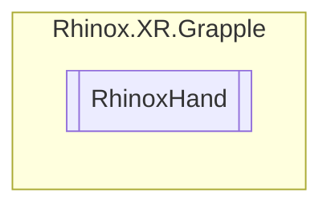

# RhinoxHand `Public enum`

## Description

This enum defines the different types of hands.

## Diagram

## Details

### Summary

This enum defines the different types of hands.

### Fields

#### Left

##### Summary

A left hand.

#### Right

##### Summary

A right hand.

#### Invalid

##### Summary

A value to represent an invalid value.

*Generated with* [*ModularDoc*](https://github.com/hailstorm75/ModularDoc)
