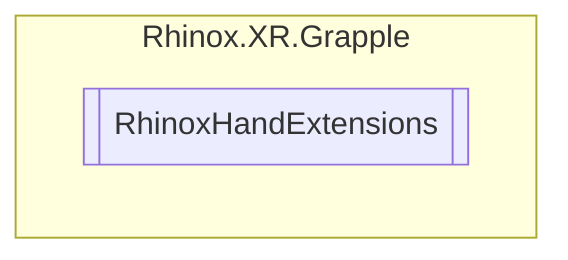

# RhinoxHandExtensions `Public class`

## Diagram



## Members

### Methods

#### Public Static methods

| Returns                                         | Name                                                                                                                                                                                                                                                                                      |
|-------------------------------------------------|-------------------------------------------------------------------------------------------------------------------------------------------------------------------------------------------------------------------------------------------------------------------------------------------|
| [`RhinoxHand`](./rhinoxxrgrapple-RhinoxHand) | [`GetInverse`](#getinverse)([`RhinoxHand`](./rhinoxxrgrapple-RhinoxHand) hand)<br>Returns the inverse hand for the given hand. If the hand is Left, returns Right; if the hand is Right, returns Left.<br>            If the input hand is Invalid, logs an error and returns Invalid. |

## Details

### Methods

#### GetInverse

```csharp
public static RhinoxHand GetInverse(RhinoxHand hand)
```

##### Arguments

| Type                                            | Name | Description                     |
|-------------------------------------------------|------|---------------------------------|
| [`RhinoxHand`](./rhinoxxrgrapple-RhinoxHand) | hand | The hand to get the inverse of. |

##### Summary

Returns the inverse hand for the given hand. If the hand is Left, returns Right; if the hand is Right, returns Left.
If the input hand is Invalid, logs an error and returns Invalid.

##### Returns

The inverse hand.

*Generated with* [*ModularDoc*](https://github.com/hailstorm75/ModularDoc)
