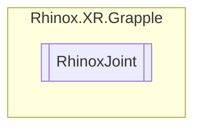

# RhinoxJoint `Public class`

## Description

Represents a joint in a Grapple application.

## Diagram



## Details

### Summary

Represents a joint in a Grapple application.

### Constructors

#### RhinoxJoint

```csharp
public RhinoxJoint(XRHandJointID jointID)
```

##### Arguments

| Type            | Name    | Description                                                 |
|-----------------|---------|-------------------------------------------------------------|
| `XRHandJointID` | jointID | The ID of the XRHandJoint that this RhinoxJoint represents. |

##### Summary

Creates a new RhinoxJoint instance for the specified XRHandJointID.

*Generated with* [*ModularDoc*](https://github.com/hailstorm75/ModularDoc)
