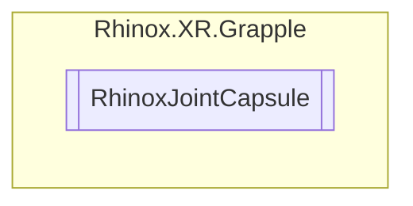

# RhinoxJointCapsule `Public class`

## Description

A class representing a joint capsule in Rhinox XR Grapple, with a rigidbody and a capsule collider.

## Diagram



## Details

### Summary

A class representing a joint capsule in Rhinox XR Grapple, with a rigidbody and a capsule collider.

### Constructors

#### RhinoxJointCapsule

```csharp
public RhinoxJointCapsule()
```

*Generated with* [*ModularDoc*](https://github.com/hailstorm75/ModularDoc)
