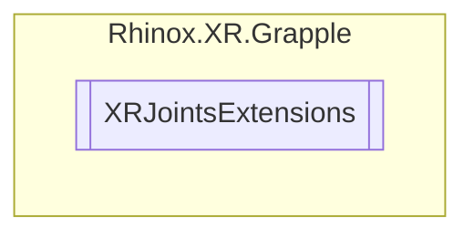

# XRJointsExtensions `Public class`

## Description

Contains extensions for XR Hand Joints.

## Diagram



## Members

### Methods

#### Public Static methods

| Returns | Name                                                                                                                                                  |
|---------|-------------------------------------------------------------------------------------------------------------------------------------------------------|
| `bool`  | [`IsDistal`](#isdistal)(`XRHandJointID` joint)<br>Returns a boolean value indicating if the specified XR hand joint ID is a distal joint.             |
| `bool`  | [`IsMetacarpal`](#ismetacarpal)(`XRHandJointID` joint)<br>Returns a boolean value indicating if the specified XR hand joint ID is a metacarpal joint. |
| `bool`  | [`IsProximal`](#isproximal)(`XRHandJointID` joint)<br>Returns a boolean value indicating if the specified XR hand joint ID is a proximal joint.       |
| `bool`  | [`IsTip`](#istip)(`XRHandJointID` joint)<br>Returns a boolean value indicating if the specified XR hand joint ID is a tip joint.                      |

## Details

### Summary

Contains extensions for XR Hand Joints.

### Methods

#### IsDistal

```csharp
public static bool IsDistal(XRHandJointID joint)
```

##### Arguments

| Type            | Name  | Description                    |
|-----------------|-------|--------------------------------|
| `XRHandJointID` | joint | The XR hand joint ID to check. |

##### Summary

Returns a boolean value indicating if the specified XR hand joint ID is a distal joint.

##### Returns

True if the specified XR hand joint ID is a distal joint, otherwise false.

#### IsMetacarpal

```csharp
public static bool IsMetacarpal(XRHandJointID joint)
```

##### Arguments

| Type            | Name  | Description                    |
|-----------------|-------|--------------------------------|
| `XRHandJointID` | joint | The XR hand joint ID to check. |

##### Summary

Returns a boolean value indicating if the specified XR hand joint ID is a metacarpal joint.

##### Returns

True if the specified XR hand joint ID is a metacarpal joint, otherwise false.

#### IsProximal

```csharp
public static bool IsProximal(XRHandJointID joint)
```

##### Arguments

| Type            | Name  | Description                    |
|-----------------|-------|--------------------------------|
| `XRHandJointID` | joint | The XR hand joint ID to check. |

##### Summary

Returns a boolean value indicating if the specified XR hand joint ID is a proximal joint.

##### Returns

True if the specified XR hand joint ID is a proximal joint, otherwise false.

#### IsTip

```csharp
public static bool IsTip(XRHandJointID joint)
```

##### Arguments

| Type            | Name  | Description                    |
|-----------------|-------|--------------------------------|
| `XRHandJointID` | joint | The XR hand joint ID to check. |

##### Summary

Returns a boolean value indicating if the specified XR hand joint ID is a tip joint.

##### Returns

True if the specified XR hand joint ID is a tip joint, otherwise false.

*Generated with* [*ModularDoc*](https://github.com/hailstorm75/ModularDoc)
