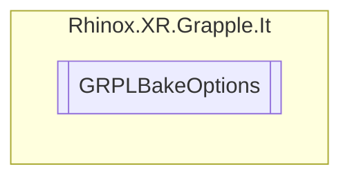

# GRPLBakeOptions `Public enum`

## Description

This enum is used to control mesh baking behaviour.

## Diagram

## Details

### Summary

This enum is used to control mesh baking behaviour.

### Fields

#### NoBake

##### Summary

Indicates that no baking of meshes will occur.

#### StandardBake

##### Summary

Indicates that standard baking of meshes will occur.

#### BakeAndParent

##### Summary

Indicates that baking of meshes will occur, and the result will be parented to the object.

*Generated with* [*ModularDoc*](https://github.com/hailstorm75/ModularDoc)
