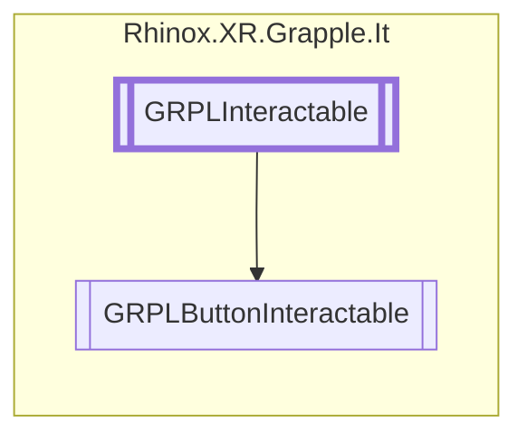

# GRPLButtonInteractable `Public class`

## Description

This is a Button interactible that can be used for both UI and Mesh based buttons. The base transform is the button
base. The interact object is the button surface.

## Diagram



## Members

### Methods

#### Protected  methods

| Returns | Name                                                                                 |
|---------|--------------------------------------------------------------------------------------|
| `void`  | [`Initialize`](#initialize)()<br>Used to initialize the button.                      |
| `void`  | [`InteractStopped`](#interactstopped)()<br>Used to stop interaction with the button. |
| `void`  | [`OnDrawGizmos`](#ondrawgizmos)()                                                    |
| `void`  | [`ProximityStopped`](#proximitystopped)()<br>Used to stop proximity with the button. |

#### Public  methods

| Returns     | Name                                                                                                                                                  |
|-------------|-------------------------------------------------------------------------------------------------------------------------------------------------------|
| `bool`      | [`CheckForInteraction`](#checkforinteraction)(`RhinoxJoint` joint, `RhinoxHand` hand)                                                                 |
| `Transform` | [`GetReferenceTransform`](#getreferencetransform)()                                                                                                   |
| `bool`      | [`ShouldInteractionCheckStop`](#shouldinteractioncheckstop)()                                                                                         |
| `bool`      | [`TryGetCurrentInteractJoint`](#trygetcurrentinteractjoint)(`ICollection`&lt;`RhinoxJoint`&gt; joints, out `RhinoxJoint` outJoint, `RhinoxHand` hand) |

## Details

### Summary

This is a Button interactible that can be used for both UI and Mesh based buttons. The base transform is the button
base. The interact object is the button surface.

### Remarks

The vector from the base to the surface should follow the local forward vector!

### Inheritance

- [
  `GRPLInteractable`
  ](./rhinoxxrgrappleit-GRPLInteractable)

### Constructors

#### GRPLButtonInteractable

```csharp
public GRPLButtonInteractable()
```

### Methods

#### Initialize

```csharp
protected override void Initialize()
```

##### Summary

Used to initialize the button.

#### InteractStopped

```csharp
protected override void InteractStopped()
```

##### Summary

Used to stop interaction with the button.

#### ProximityStopped

```csharp
protected override void ProximityStopped()
```

##### Summary

Used to stop proximity with the button.

#### CheckForInteraction

```csharp
public override bool CheckForInteraction(RhinoxJoint joint, RhinoxHand hand)
```

##### Arguments

| Type          | Name  | Description |
|---------------|-------|-------------|
| `RhinoxJoint` | joint |             |
| `RhinoxHand`  | hand  |             |

#### TryGetCurrentInteractJoint

```csharp
public override bool TryGetCurrentInteractJoint(ICollection<RhinoxJoint> joints, out RhinoxJoint outJoint, RhinoxHand hand)
```

##### Arguments

| Type                               | Name     | Description |
|------------------------------------|----------|-------------|
| `ICollection`&lt;`RhinoxJoint`&gt; | joints   |             |
| `out` `RhinoxJoint`                | outJoint |             |
| `RhinoxHand`                       | hand     |             |

#### ShouldInteractionCheckStop

```csharp
public override bool ShouldInteractionCheckStop()
```

#### GetReferenceTransform

```csharp
public override Transform GetReferenceTransform()
```

#### OnDrawGizmos

```csharp
protected override void OnDrawGizmos()
```

### Events

#### ButtonDown

```csharp
public event Action<GRPLButtonInteractable> ButtonDown
```

##### Summary

An event that occurs when the button is pressed down. The event takes a GRPLButtonInteractable as a parameter.

#### ButtonUp

```csharp
public event Action<GRPLButtonInteractable> ButtonUp
```

##### Summary

An event that occurs when the button is released. The event takes a GRPLButtonInteractable as a parameter.

#### ButtonPressed

```csharp
public event Action<GRPLButtonInteractable> ButtonPressed
```

##### Summary

An event that occurs when the button is held down. The event takes a GRPLButtonInteractable as a parameter.

*Generated with* [*ModularDoc*](https://github.com/hailstorm75/ModularDoc)
