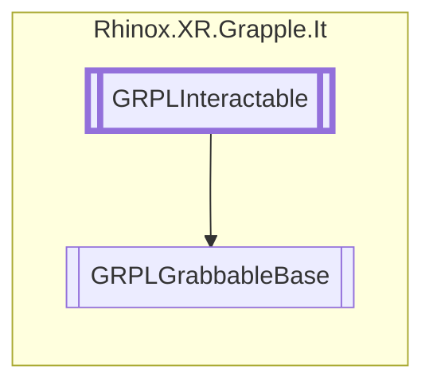

# GRPLGrabbableBase `Public class`

## Description

Base class to make an object grabbable, this can be via a bounding box or via a list of trigger colliders used as
bounding box.

## Diagram



## Members

### Properties

#### Public  properties

| Type   | Name                      | Methods              |
|--------|---------------------------|----------------------|
| `bool` | [`IsGrabbed`](#isgrabbed) | `get, protected set` |

### Methods

#### Protected  methods

| Returns | Name                                                                          |
|---------|-------------------------------------------------------------------------------|
| `void`  | [`Awake`](#awake)()                                                           |
| `void`  | [`DropInternal`](#dropinternal)()                                             |
| `void`  | [`GrabInternal`](#grabinternal)(`GameObject` parent, `RhinoxHand` rhinoxHand) |
| `void`  | [`Initialize`](#initialize)()                                                 |
| `void`  | [`OnDisable`](#ondisable)()                                                   |
| `void`  | [`OnDrawGizmos`](#ondrawgizmos)()                                             |
| `void`  | [`OnEnable`](#onenable)()                                                     |

#### Public  methods

| Returns | Name                                                                                                                                                  |
|---------|-------------------------------------------------------------------------------------------------------------------------------------------------------|
| `bool`  | [`CheckForInteraction`](#checkforinteraction)(`RhinoxJoint` joint, `RhinoxHand` hand)                                                                 |
| `void`  | [`TryDrop`](#trydrop)(`RhinoxHand` hand)                                                                                                              |
| `bool`  | [`TryGetCurrentInteractJoint`](#trygetcurrentinteractjoint)(`ICollection`&lt;`RhinoxJoint`&gt; joints, out `RhinoxJoint` outJoint, `RhinoxHand` hand) |
| `void`  | [`TryGrab`](#trygrab)(`RhinoxHand` hand)                                                                                                              |

## Details

### Summary

Base class to make an object grabbele, this can be via a bounding box or via a list of trigge rcolliders used as
bounding box.

### Remarks

### Inheritance

- [
  `GRPLInteractable`
  ](./rhinoxxrgrappleit-GRPLInteractable)

### Constructors

#### GRPLGrabbableBase

```csharp
public GRPLGrabbableBase()
```

### Methods

#### Awake

```csharp
protected void Awake()
```

#### Initialize

```csharp
protected override void Initialize()
```

#### OnEnable

```csharp
protected override void OnEnable()
```

#### OnDisable

```csharp
protected override void OnDisable()
```

#### CheckForInteraction

```csharp
public override bool CheckForInteraction(RhinoxJoint joint, RhinoxHand hand)
```

##### Arguments

| Type          | Name  | Description |
|---------------|-------|-------------|
| `RhinoxJoint` | joint |             |
| `RhinoxHand`  | hand  |             |

#### TryGetCurrentInteractJoint

```csharp
public override bool TryGetCurrentInteractJoint(ICollection<RhinoxJoint> joints, out RhinoxJoint outJoint, RhinoxHand hand)
```

##### Arguments

| Type                               | Name     | Description |
|------------------------------------|----------|-------------|
| `ICollection`&lt;`RhinoxJoint`&gt; | joints   |             |
| `out` `RhinoxJoint`                | outJoint |             |
| `RhinoxHand`                       | hand     |             |

#### TryGrab

```csharp
public void TryGrab(RhinoxHand hand)
```

##### Arguments

| Type         | Name | Description |
|--------------|------|-------------|
| `RhinoxHand` | hand |             |

#### TryDrop

```csharp
public void TryDrop(RhinoxHand hand)
```

##### Arguments

| Type         | Name | Description |
|--------------|------|-------------|
| `RhinoxHand` | hand |             |

#### GrabInternal

```csharp
protected virtual void GrabInternal(GameObject parent, RhinoxHand rhinoxHand)
```

##### Arguments

| Type         | Name       | Description |
|--------------|------------|-------------|
| `GameObject` | parent     |             |
| `RhinoxHand` | rhinoxHand |             |

#### DropInternal

```csharp
protected virtual void DropInternal()
```

#### OnDrawGizmos

```csharp
protected override void OnDrawGizmos()
```

### Properties

#### IsGrabbed

```csharp
public bool IsGrabbed { get; protected set; }
```

*Generated with* [*ModularDoc*](https://github.com/hailstorm75/ModularDoc)
