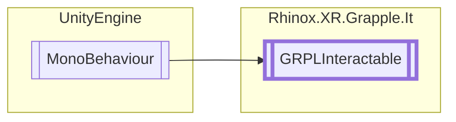

# GRPLInteractable `Public class`

## Description

This is an abstract base class used for Grapple interactables.
The derived interactables work seamlessly with
the [GRPLInteractableManager](./rhinoxxrgrappleit-GRPLInteractableManager) if all the pure abstract methods are
correctly implemented. This class provides events and methods for detecting proximity and interaction with
the interactable object.

## Diagram



## Members

### Properties

#### Public  properties

| Type                                                                  | Name                                                                                                                                     | Methods    |
|-----------------------------------------------------------------------|------------------------------------------------------------------------------------------------------------------------------------------|------------|
| `XRHandJointID`                                                       | [`ProximateJointID`](#proximatejointid)<br>A read-only property that returns _proximateJointID.                                          | `get`      |
| `float`                                                               | [`ProximateRadius`](#proximateradius)<br>A read-only property that returns _proximateRadius.                                             | `get`      |
| `bool`                                                                | [`ShouldPerformInteractCheck`](#shouldperforminteractcheck)<br>A boolean that determines whether interaction checks should be performed. | `get, set` |
| [`GRPLInteractionState`](./rhinoxxrgrappleit-GRPLInteractionState) | [`State`](#state)<br>A read-only property that returns the current state of the interactable object.                                     | `get`      |

### Methods

#### Protected  methods

| Returns | Name                                                                                                                                                  |
|---------|-------------------------------------------------------------------------------------------------------------------------------------------------------|
| `void`  | [`Destroyed`](#destroyed)()<br>A virtual method that can be overridden in derived classes to perform tasks when the interactable object is destroyed. |
| `void`  | [`Initialize`](#initialize)()<br>A virtual method that can be overridden in derived classes to perform initialization tasks.                          |
| `void`  | [`InteractStarted`](#interactstarted)()<br>Invokes the OnInteractStarted event.                                                                       |
| `void`  | [`InteractStopped`](#interactstopped)()<br>Invokes the OnInteractEnded event.                                                                         |
| `void`  | [`OnDestroy`](#ondestroy)()<br>Invokes the InteractableDestroyed event and calls the Destroyed methods.                                               |
| `void`  | [`OnDisable`](#ondisable)()<br>Sets the state of this interactable to disabled.                                                                       |
| `void`  | [`OnDrawGizmos`](#ondrawgizmos)()                                                                                                                     |
| `void`  | [`OnEnable`](#onenable)()<br>Sets the state of this interactable to active.                                                                           |
| `void`  | [`ProximityStarted`](#proximitystarted)()<br>Invokes the OnProximityStarted event.                                                                    |
| `void`  | [`ProximityStopped`](#proximitystopped)()<br>Invokes the OnProximityStopped event.                                                                    |
| `void`  | [`Start`](#start)()<br>Calls the Initialize method and invoke the InteractableCreated event.                                                          |

#### Public  methods

| Returns     | Name                                                                                                                                                                                                                                               |
|-------------|----------------------------------------------------------------------------------------------------------------------------------------------------------------------------------------------------------------------------------------------------|
| `bool`      | [`CheckForInteraction`](#checkforinteraction)(`RhinoxJoint` joint, `RhinoxHand` hand)<br>Check whether the given joint activates the interaction for this interactable.                                                                            |
| `Transform` | [`GetReferenceTransform`](#getreferencetransform)()<br>Returns the reference transform for this interactible. This can be used for proximate interaction checking.                                                                                 |
| `void`      | [`SetState`](#setstate)([`GRPLInteractionState`](./rhinoxxrgrappleit-GRPLInteractionState) newState)<br>Sets the new state for this interactable object and invokes the according events.                                                       |
| `bool`      | [`ShouldInteractionCheckStop`](#shouldinteractioncheckstop)()<br>Check, when currently interacting. If the interaction should not get checked anymore.<br>            I.e. When the previous interact joint is now behind the button press object. |
| `bool`      | [`TryGetCurrentInteractJoint`](#trygetcurrentinteractjoint)(`ICollection`&lt;`RhinoxJoint`&gt; joints, out `RhinoxJoint` outJoint, `RhinoxHand` hand)                                                                                              |

## Details

### Summary

This is an abstract base class used for Grapple interactables.
The derived interactables work seamlessly with
the [GRPLInteractableManager](./rhinoxxrgrappleit-GRPLInteractableManager) if all the pure abstract methods are
correctly implemented. This class provides events and methods for detecting proximity and interaction with
the interactable object.

### Remarks

The [GRPLInteractable](rhinoxxrgrappleit-GRPLInteractable).[Start](#start)
and [GRPLInteractable](rhinoxxrgrappleit-GRPLInteractable).[OnDestroy](#ondestroy) should NOT be overwritten.
Use [GRPLInteractable](rhinoxxrgrappleit-GRPLInteractable).[Initialize](#initialize) [GRPLInteractable](rhinoxxrgrappleit-GRPLInteractable).[Destroyed](#destroyed)
respectively instead.

### Inheritance

- `MonoBehaviour`

### Constructors

#### GRPLInteractable

```csharp
protected GRPLInteractable()
```

### Methods

#### Start

```csharp
protected virtual void Start()
```

##### Summary

Calls the Initialize method and invoke the InteractableCreated event.

#### OnDestroy

```csharp
protected virtual void OnDestroy()
```

##### Summary

Invokes the InteractableDestroyed event and calls the Destroyed methods.

#### Initialize

```csharp
protected virtual void Initialize()
```

##### Summary

A virtual method that can be overridden in derived classes to perform initialization tasks.

#### Destroyed

```csharp
protected virtual void Destroyed()
```

##### Summary

A virtual method that can be overridden in derived classes to perform tasks when the interactable object is destroyed.

#### OnEnable

```csharp
protected virtual void OnEnable()
```

##### Summary

Sets the state of this interactable to active.

#### OnDisable

```csharp
protected virtual void OnDisable()
```

##### Summary

Sets the state of this interactable to disabled.

#### SetState

```csharp
public void SetState(GRPLInteractionState newState)
```

##### Arguments

| Type                                                                  | Name     | Description                                |
|-----------------------------------------------------------------------|----------|--------------------------------------------|
| [`GRPLInteractionState`](./rhinoxxrgrappleit-GRPLInteractionState) | newState | The new state for the interactable object. |

##### Summary

Sets the new state for this interactable object and invokes the according events.

##### Remarks

Return early if the newState equals the current state of the interactable object.

#### InteractStarted

```csharp
protected virtual void InteractStarted()
```

##### Summary

Invokes the OnInteractStarted event.

#### InteractStopped

```csharp
protected virtual void InteractStopped()
```

##### Summary

Invokes the OnInteractEnded event.

#### ProximityStarted

```csharp
protected virtual void ProximityStarted()
```

##### Summary

Invokes the OnProximityStarted event.

#### ProximityStopped

```csharp
protected virtual void ProximityStopped()
```

##### Summary

Invokes the OnProximityStopped event.

#### ShouldInteractionCheckStop

```csharp
public virtual bool ShouldInteractionCheckStop()
```

##### Summary

Check, when currently interacting. If the interaction should not get checked anymore.
I.e. When the previous interact joint is now behind the button press object.

#### GetReferenceTransform

```csharp
public virtual Transform GetReferenceTransform()
```

##### Summary

Returns the reference transform for this interactible. This can be used for proximate interaction checking.

##### Returns

The reference transform.

#### CheckForInteraction

```csharp
public abstract bool CheckForInteraction(RhinoxJoint joint, RhinoxHand hand)
```

##### Arguments

| Type          | Name  | Description                      |
|---------------|-------|----------------------------------|
| `RhinoxJoint` | joint | The joint to check with.         |
| `RhinoxHand`  | hand  | The hand that the joint is from. |

##### Summary

Check whether the given joint activates the interaction for this interactable.

##### Returns

Whether the interaction is now happening.

#### TryGetCurrentInteractJoint

```csharp
public abstract bool TryGetCurrentInteractJoint(ICollection<RhinoxJoint> joints, out RhinoxJoint outJoint, RhinoxHand hand)
```

##### Arguments

| Type                               | Name     | Description |
|------------------------------------|----------|-------------|
| `ICollection`&lt;`RhinoxJoint`&gt; | joints   |             |
| `out` `RhinoxJoint`                | outJoint |             |
| `RhinoxHand`                       | hand     |             |

#### OnDrawGizmos

```csharp
protected virtual void OnDrawGizmos()
```

### Properties

#### ProximateJointID

```csharp
public XRHandJointID ProximateJointID { get; }
```

##### Summary

A read-only property that returns _proximateJointID.

#### ProximateRadius

```csharp
public float ProximateRadius { get; }
```

##### Summary

A read-only property that returns _proximateRadius.

#### State

```csharp
public GRPLInteractionState State { get; }
```

##### Summary

A read-only property that returns the current state of the interactable object.

#### ShouldPerformInteractCheck

```csharp
public bool ShouldPerformInteractCheck { get; set; }
```

##### Summary

A boolean that determines whether interaction checks should be performed.

### Events

#### OnInteractStarted

```csharp
public event Action<GRPLInteractable> OnInteractStarted
```

##### Summary

An event that is invoked when interaction with the interactable object starts.

#### OnInteractEnded

```csharp
public event Action<GRPLInteractable> OnInteractEnded
```

##### Summary

An event that is invoked when interaction with the interactable object ends.

#### OnProximityStarted

```csharp
public event Action<GRPLInteractable> OnProximityStarted
```

##### Summary

An event that is invoked when the user is close enough to the interactable object for proximity detection.

#### OnProximityEnded

```csharp
public event Action<GRPLInteractable> OnProximityEnded
```

##### Summary

An event that is invoked when the user is no longer close enough to the interactable object for proximity detection.

### Delegates

#### InteractableEvent

```csharp
public delegate void InteractableEvent(GRPLInteractable grappleInteractable)
```

##### Arguments

| Type                                                        | Name                | Description |
|-------------------------------------------------------------|---------------------|-------------|
| [`GRPLInteractable`](rhinoxxrgrappleit-GRPLInteractable) | grappleInteractable |             |

*Generated with* [*ModularDoc*](https://github.com/hailstorm75/ModularDoc)
