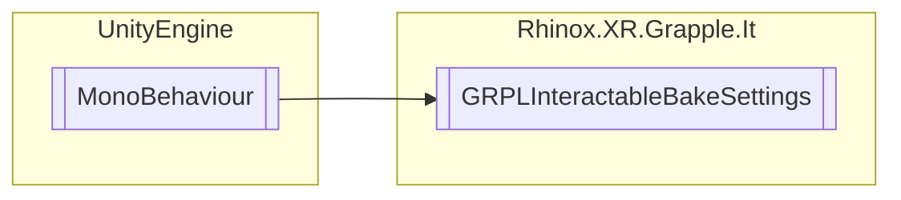

# GRPLInteractableBakeSettings `Public class`

## Description

This class is used to define the bake options for a [GRPLInteractable](./rhinoxxrgrappleit-GRPLInteractable) object.
The [GRPLBakeOptions](./rhinoxxrgrappleit-GRPLBakeOptions) enumeration specifies the different options available.
By setting the BakeOptions field to one of the available options, the behavior of the
interactable object when it is baked can be controlled.

## Diagram



## Members

### Properties

#### Public  properties

| Type                                                        | Name                                                                                    | Methods |
|-------------------------------------------------------------|-----------------------------------------------------------------------------------------|---------|
| [`GRPLBakeOptions`](./rhinoxxrgrappleit-GRPLBakeOptions) | [`BakeOptions`](#bakeoptions)<br>A getter property that returns the _bakeOptions field. | `get`   |

## Details

### Summary

This class is used to define the bake options for a [GRPLInteractable](./rhinoxxrgrappleit-GRPLInteractable) object.
The [GRPLBakeOptions](./rhinoxxrgrappleit-GRPLBakeOptions) enumeration specifies the different options available.
By setting the BakeOptions field to one of the available options, the behavior of the
interactable object when it is baked can be controlled.

### Inheritance

- `MonoBehaviour`

### Constructors

#### GRPLInteractableBakeSettings

```csharp
public GRPLInteractableBakeSettings()
```

### Properties

#### BakeOptions

```csharp
public GRPLBakeOptions BakeOptions { get; }
```

##### Summary

A getter property that returns the _bakeOptions field.

*Generated with* [*ModularDoc*](https://github.com/hailstorm75/ModularDoc)
