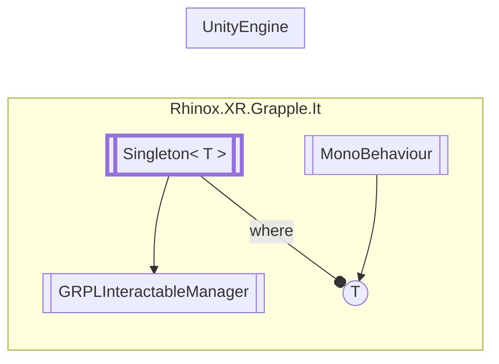

# GRPLInteractableManager `Public class`

## Description

This object is responsible for calculating all interactions between the hands defined by the jointManager
field and all interactables in the scene that inherit from GRPLInteractable.

## Diagram



## Members

### Methods

#### Public  methods

| Returns | Name                                                                         |
|---------|------------------------------------------------------------------------------|
| `void`  | [`Awake`](#awake)()<br>Initializes this instance of GRPLInteractableManager. |

## Details

### Summary

This object is responsible for calculating all interactions between the hands defined by the jointManager
field and all interactables in the scene that inherit from GRPLInteractable.

### Inheritance

- [`Singleton`](./rhinoxxrgrappleit-SingletonT)
  &lt;[`GRPLInteractableManager`](rhinoxxrgrappleit-GRPLInteractableManager)&gt;

### Constructors

#### GRPLInteractableManager

```csharp
public GRPLInteractableManager()
```

### Methods

#### Awake

```csharp
public void Awake()
```

##### Summary

Initializes this instance of GRPLInteractableManager.

### Events

#### InteractibleInteractionCheckPaused

```csharp
public event Action<RhinoxHand, GRPLInteractable> InteractibleInteractionCheckPaused
```

##### Summary

Invoked when an interactable's interaction check is paused.

#### InteractibleInteractionCheckResumed

```csharp
public event Action<RhinoxHand, GRPLInteractable> InteractibleInteractionCheckResumed
```

##### Summary

Invoked when an interactable's interaction check is resumed.

#### InteractibleLeftProximity

```csharp
public event Action<RhinoxHand, GRPLInteractable> InteractibleLeftProximity
```

##### Summary

Invoked when an interactable is no longer in proximity of a hand.

*Generated with* [*ModularDoc*](https://github.com/hailstorm75/ModularDoc)
