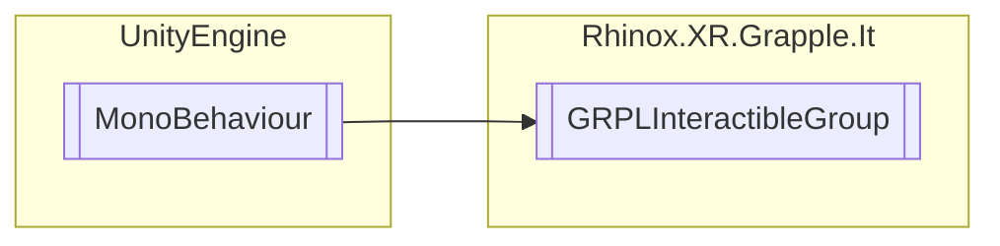

# GRPLInteractibleGroup `Public class`

## Description

This component defines a group of interactables that can only be interacted with one at a time. It provides
functionality to enable and disable a list of interactables based on which one is currently being interacted
with. It also provides the ability to filter out interactables that cannot be interacted with based on the
current state of the group.

## Diagram



## Members

### Methods

#### Public  methods

| Returns | Name                                                                                                                                                                  |
|---------|-----------------------------------------------------------------------------------------------------------------------------------------------------------------------|
| `void`  | [`FilterImpossibleInteractables`](#filterimpossibleinteractables)(ref `List`&lt;[`GRPLInteractable`](./rhinoxxrgrappleit-GRPLInteractable)&gt; otherInteractables) |

## Details

### Summary

This component defines a group of interactables that can only be interacted with one at a time. It provides
functionality to enable and disable a list of interactables based on which one is currently being interacted
with. It also provides the ability to filter out interactables that cannot be interacted with based on the
current state of the group. ///

### Inheritance

- `MonoBehaviour`

### Constructors

#### GRPLInteractibleGroup

```csharp
public GRPLInteractibleGroup()
```

### Methods

#### FilterImpossibleInteractables

```csharp
public void FilterImpossibleInteractables(ref List<GRPLInteractable> otherInteractables)
```

##### Arguments

| Type                                                                              | Name               | Description |
|-----------------------------------------------------------------------------------|--------------------|-------------|
| `ref` `List`&lt;[`GRPLInteractable`](./rhinoxxrgrappleit-GRPLInteractable)&gt; | otherInteractables |             |

*Generated with* [*ModularDoc*](https://github.com/hailstorm75/ModularDoc)
