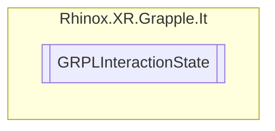

# GRPLInteractionState `Public enum`

## Description

The possible states a Grapple Interactible can be in.

## Diagram

## Details

### Summary

The possible states a Grapple Interactible can be in.

### Fields

#### Active

##### Summary

The neutral state of a grapple interactible. This means all checks can happen for the object.

#### Proximate

##### Summary

This state is used when a grapple interactible is in proximity to hands.

#### Interacted

##### Summary

This state is used when a hand is currently interacting with the grapple interactible.

#### Disabled

##### Summary

This state is used when a grapple interactible is disabled and no proximity or interactions checks should happen.

*Generated with* [*ModularDoc*](https://github.com/hailstorm75/ModularDoc)
