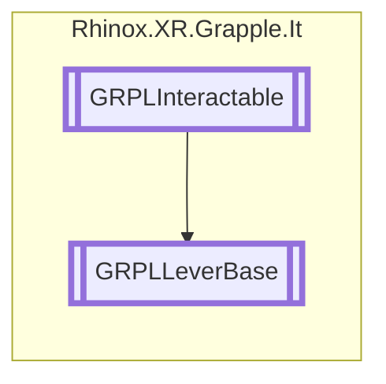

# GRPLLeverBase `Public class`

## Description

The GRPLLeverBase class is an abstract class that extends from GRPLInteractable. The class is used to derive lever-type
interactable objects, and it includes additional methods and properties
for that functionality.

## Diagram



## Members

### Methods

#### Protected  methods

| Returns | Name                                                                                                                                                                                                                                                                   |
|---------|------------------------------------------------------------------------------------------------------------------------------------------------------------------------------------------------------------------------------------------------------------------------|
| `void`  | [`Awake`](#awake)()<br>Initializes the class by setting the forced interactible joint and linking to the gesture recognizer.                                                                                                                                           |
| `void`  | [`DrawGrabRange`](#drawgrabrange)()<br>Draws the grab range of the lever in the Unity editor.                                                                                                                                                                          |
| `void`  | [`DrawLeverTransforms`](#drawlevertransforms)()<br>Draws the transforms of the lever in the Unity editor.                                                                                                                                                              |
| `float` | [`GetLeverRotation`](#getleverrotation)(`Vector3` projectedPos)<br>Calculates and returns the current rotation of the lever based on the projected position of the hand onto<br>            the plane defined by the base position and forward direction of the lever. |

#### Public  methods

| Returns     | Name                                                                                                                                                                                                                                                                                                                           |
|-------------|--------------------------------------------------------------------------------------------------------------------------------------------------------------------------------------------------------------------------------------------------------------------------------------------------------------------------------|
| `bool`      | [`CheckForInteraction`](#checkforinteraction)(`RhinoxJoint` joint, `RhinoxHand` hand)<br>Returns false and logs an error message indicating that this class does not implement the functionality of an interactable.<br>            This method should be overridden in derived classes to provide specific interaction logic. |
| `Transform` | [`GetReferenceTransform`](#getreferencetransform)()<br>Returns the transform of the handle as the reference transform for the interactable object.                                                                                                                                                                             |
| `bool`      | [`TryGetCurrentInteractJoint`](#trygetcurrentinteractjoint)(`ICollection`&lt;`RhinoxJoint`&gt; joints, out `RhinoxJoint` joint, `RhinoxHand` hand)                                                                                                                                                                             |

## Details

### Summary

The GRPLLeverBase class is an abstract class that extends from GRPLInteractable. The class is used to derive lever-type
interactable objects, and it includes additional methods and properties
for that functionality.

### Inheritance

- [
  `GRPLInteractable`
  ](./rhinoxxrgrappleit-GRPLInteractable)

### Constructors

#### GRPLLeverBase

```csharp
protected GRPLLeverBase()
```

### Methods

#### Awake

```csharp
protected void Awake()
```

##### Summary

Initializes the class by setting the forced interactible joint and linking to the gesture recognizer.

#### GetLeverRotation

```csharp
protected abstract float GetLeverRotation(Vector3 projectedPos)
```

##### Arguments

| Type      | Name         | Description                                                                                |
|-----------|--------------|--------------------------------------------------------------------------------------------|
| `Vector3` | projectedPos | The reference point projected on the plane defined by the lever base position and forward. |

##### Summary

Calculates and returns the current rotation of the lever based on the projected position of the hand onto
the plane defined by the base position and forward direction of the lever.

##### Returns

The angle in degrees.

#### GetReferenceTransform

```csharp
public override Transform GetReferenceTransform()
```

##### Summary

Returns the transform of the handle as the reference transform for the interactable object.

##### Returns

#### CheckForInteraction

```csharp
public override bool CheckForInteraction(RhinoxJoint joint, RhinoxHand hand)
```

##### Arguments

| Type          | Name  | Description |
|---------------|-------|-------------|
| `RhinoxJoint` | joint |             |
| `RhinoxHand`  | hand  |             |

##### Summary

Returns false and logs an error message indicating that this class does not implement the functionality of an
interactable.
This method should be overridden in derived classes to provide specific interaction logic.

##### Returns

#### TryGetCurrentInteractJoint

```csharp
public override bool TryGetCurrentInteractJoint(ICollection<RhinoxJoint> joints, out RhinoxJoint joint, RhinoxHand hand)
```

##### Arguments

| Type                               | Name   | Description |
|------------------------------------|--------|-------------|
| `ICollection`&lt;`RhinoxJoint`&gt; | joints |             |
| `out` `RhinoxJoint`                | joint  |             |
| `RhinoxHand`                       | hand   |             |

#### DrawLeverTransforms

```csharp
protected void DrawLeverTransforms()
```

##### Summary

Draws the transforms of the lever in the Unity editor.

#### DrawGrabRange

```csharp
protected void DrawGrabRange()
```

##### Summary

Draws the grab range of the lever in the Unity editor.

*Generated with* [*ModularDoc*](https://github.com/hailstorm75/ModularDoc)
