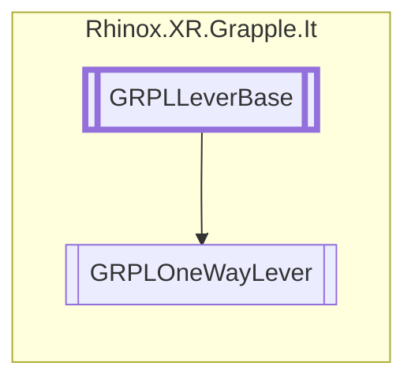

# GRPLOneWayLever `Public class`

## Description

The GRPLOneWayLever class is a subclass of GRPLLeverBase and provides functionality for one-way levers in
a 3D environment. The class contains the LeverActivated and LeverStopped events for lever activation and lever
stopping. Additionally, the class includes fields for debugging and drawing.

## Diagram



## Members

### Methods

#### Protected  methods

| Returns | Name                                                                                                                                                                  |
|---------|-----------------------------------------------------------------------------------------------------------------------------------------------------------------------|
| `float` | [`GetLeverRotation`](#getleverrotation)(`Vector3` projectedPos)<br>Calculates the angle between the projected position of the joint and the original handle position. |
| `void`  | [`Initialize`](#initialize)()<br>Initializes the initial handle position and rotation.                                                                                |
| `void`  | [`OnDrawGizmos`](#ondrawgizmos)()<br>Draws the desired gizmos.                                                                                                        |

#### Public  methods

| Returns | Name                                                                                                                                                                                                                                                   |
|---------|--------------------------------------------------------------------------------------------------------------------------------------------------------------------------------------------------------------------------------------------------------|
| `bool`  | [`CheckForInteraction`](#checkforinteraction)(`RhinoxJoint` joint, `RhinoxHand` hand)<br>Checks if a joint and hand are interacting with the lever.<br>            Returns true if the joint and hand are interacting with the lever, false otherwise. |
| `bool`  | [`TryGetCurrentInteractJoint`](#trygetcurrentinteractjoint)(`ICollection`&lt;`RhinoxJoint`&gt; joints, out `RhinoxJoint` joint, `RhinoxHand` hand)                                                                                                     |

## Details

### Summary

The GRPLOneWayLever class is a subclass of GRPLLeverBase and provides functionality for one-way levers in
a 3D environment. The class contains the LeverActivated and LeverStopped events for lever activation and lever
stopping. Additionally, the class includes fields for debugging and drawing.

### Inheritance

- [
  `GRPLLeverBase`
  ](./rhinoxxrgrappleit-GRPLLeverBase)

### Constructors

#### GRPLOneWayLever

```csharp
public GRPLOneWayLever()
```

### Methods

#### GetLeverRotation

```csharp
protected override float GetLeverRotation(Vector3 projectedPos)
```

##### Arguments

| Type      | Name         | Description                                                            |
|-----------|--------------|------------------------------------------------------------------------|
| `Vector3` | projectedPos | The position of the projected joint on the plane defined by the lever. |

##### Summary

Calculates the angle between the projected position of the joint and the original handle position.

##### Returns

#### Initialize

```csharp
protected override void Initialize()
```

##### Summary

Initializes the initial handle position and rotation.

#### CheckForInteraction

```csharp
public override bool CheckForInteraction(RhinoxJoint joint, RhinoxHand hand)
```

##### Arguments

| Type          | Name  | Description                          |
|---------------|-------|--------------------------------------|
| `RhinoxJoint` | joint | The interact joint                   |
| `RhinoxHand`  | hand  | The hand on which this joint resides |

##### Summary

Checks if a joint and hand are interacting with the lever.
Returns true if the joint and hand are interacting with the lever, false otherwise.

##### Returns

#### TryGetCurrentInteractJoint

```csharp
public override bool TryGetCurrentInteractJoint(ICollection<RhinoxJoint> joints, out RhinoxJoint joint, RhinoxHand hand)
```

##### Arguments

| Type                               | Name   | Description |
|------------------------------------|--------|-------------|
| `ICollection`&lt;`RhinoxJoint`&gt; | joints |             |
| `out` `RhinoxJoint`                | joint  |             |
| `RhinoxHand`                       | hand   |             |

#### OnDrawGizmos

```csharp
protected override void OnDrawGizmos()
```

##### Summary

Draws the desired gizmos.

### Events

#### LeverActivated

```csharp
public event Action<GRPLOneWayLever> LeverActivated
```

##### Summary

Triggered when the lever is activated.

#### LeverStopped

```csharp
public event Action<GRPLOneWayLever> LeverStopped
```

##### Summary

Triggered when the lever is stopped.

*Generated with* [*ModularDoc*](https://github.com/hailstorm75/ModularDoc)
