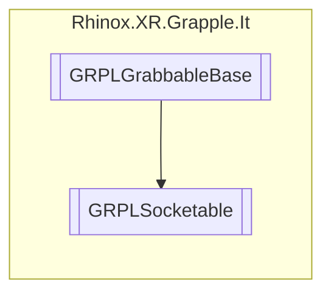

# GRPLSocketable `Public class`

## Description

This class inherits from the [GRPLGrabbableBase](./rhinoxxrgrappleit-GRPLGrabbableBase) class and adds the ability to
have socket points for grabbing.
Each hand has its own socket, so the closest socket point get correctly orientated to the hands socket.

## Diagram



## Members

### Methods

#### Protected  methods

| Returns | Name                                                                                                                                                                                                                                          |
|---------|-----------------------------------------------------------------------------------------------------------------------------------------------------------------------------------------------------------------------------------------------|
| `void`  | [`GrabInternal`](#grabinternal)(`GameObject` parent, `RhinoxHand` rhinoxHand)<br>Grabs the object with the specified hand. It finds the closest socket point to the hand and orients the<br>            object relative to the parent object. |
| `void`  | [`Initialize`](#initialize)()<br>Initializes the _maxSocketDistanceSqrd field and removes any null values from the _sockets list.                                                                                                             |

#### Public  methods

| Returns | Name                                                                                                                                                                                                                                                                                                                                                                                            |
|---------|-------------------------------------------------------------------------------------------------------------------------------------------------------------------------------------------------------------------------------------------------------------------------------------------------------------------------------------------------------------------------------------------------|
| `bool`  | [`CheckForInteraction`](#checkforinteraction)(`RhinoxJoint` joint, `RhinoxHand` hand)<br>Checks if a hand can interact with the object. If the hand is already holding the object, it returns<br>            whether the object is grabbed. Otherwise, it finds the closest socket point to the hand and sets a flag<br>            to allow the hand to grab the object if it is within range. |

## Details

### Summary

This class inherits from the [GRPLGrabbableBase](./rhinoxxrgrappleit-GRPLGrabbableBase) class and adds the ability to
have socket points for grabbing.
Each hand has its own socket, so the closest socket point get correctly orientated to the hands socket.

### Remarks

When the right hand grabs the object its orientation is mirrored compared to the left hand.

### Inheritance

- [
  `GRPLGrabbableBase`
  ](./rhinoxxrgrappleit-GRPLGrabbableBase)

### Constructors

#### GRPLSocketable

```csharp
public GRPLSocketable()
```

### Methods

#### Initialize

```csharp
protected override void Initialize()
```

##### Summary

Initializes the _maxSocketDistanceSqrd field and removes any null values from the _sockets list.

#### CheckForInteraction

```csharp
public override bool CheckForInteraction(RhinoxJoint joint, RhinoxHand hand)
```

##### Arguments

| Type          | Name  | Description                                   |
|---------------|-------|-----------------------------------------------|
| `RhinoxJoint` | joint | The interact joint.                           |
| `RhinoxHand`  | hand  | The hand on which the interact joint resides. |

##### Summary

Checks if a hand can interact with the object. If the hand is already holding the object, it returns
whether the object is grabbed. Otherwise, it finds the closest socket point to the hand and sets a flag
to allow the hand to grab the object if it is within range.

##### Returns

#### GrabInternal

```csharp
protected override void GrabInternal(GameObject parent, RhinoxHand rhinoxHand)
```

##### Arguments

| Type         | Name       | Description                    |
|--------------|------------|--------------------------------|
| `GameObject` | parent     | The socket target in the hand. |
| `RhinoxHand` | rhinoxHand | The current hand.              |

##### Summary

Grabs the object with the specified hand. It finds the closest socket point to the hand and orients the
object relative to the parent object.

*Generated with* [*ModularDoc*](https://github.com/hailstorm75/ModularDoc)
