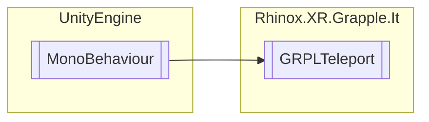

# GRPLTeleport `Public class`

## Description

Teleport script that can be used with handtracking or controller. Nothing needs to be called externally when
usinghandtracking, as all the internal logic takes care of that. When using it with controller, the user needs to
call ' [GRPLTeleport](rhinoxxrgrappleit-GRPLTeleport).[ShowArc](#showarc) ' to toggle the arc visual
and [GRPLTeleport](rhinoxxrgrappleit-GRPLTeleport).CalculateTeleportLocation(UnityEngine.Ray) , where the ray is the
startpoint and direction the teleport arc should go in.

## Diagram



## Members

### Properties

#### Public  properties

| Type      | Name                                                                                                 | Methods    |
|-----------|------------------------------------------------------------------------------------------------------|------------|
| `bool`    | [`IsInitialized`](#isinitialized)<br>Public getter property for _isInitialized.                      | `get`      |
| `bool`    | [`IsValidTeleportPoint`](#isvalidteleportpoint)<br>Public getter property for _isValidTeleportPoint. | `get`      |
| `bool`    | [`ShowArc`](#showarc)<br>Enable or disable the line rendering                                        | `get, set` |
| `Vector3` | [`TeleportPoint`](#teleportpoint)<br>Public getter property for _avgTeleportPoint.                   | `get`      |

### Methods

#### Public  methods

| Returns | Name                                                                                                                                                                                                                                                                                                                                                                                                                                                                                                                                                                                                                                                                                                                                                                                                                        |
|---------|-----------------------------------------------------------------------------------------------------------------------------------------------------------------------------------------------------------------------------------------------------------------------------------------------------------------------------------------------------------------------------------------------------------------------------------------------------------------------------------------------------------------------------------------------------------------------------------------------------------------------------------------------------------------------------------------------------------------------------------------------------------------------------------------------------------------------------|
| `void`  | [`CalculateTeleportLocation`](#calculateteleportlocation)(`Ray` startRay)<br>This method takes a Ray as input and calculates the points of the teleportation arc using the initial<br>            velocity, gravity, and maximum distance. It then calls CalculateIntersectionPoint to find the intersection<br>            point between the arc and the environment. If a valid teleportation point is found, it sets<br>            _avgTeleportPoint to the average position of all the valid teleportation points, sets the position of the<br>            _teleportZoneVisual game object to _avgTeleportPoint, and sets _isValidTeleportPoint to true. Otherwise, it<br>            sets _lineRenderer's colors to red, sets _isValidTeleportPoint to false, and clears the _teleportPositions<br>            queue. |
| `void`  | [`Initialize`](#initialize)()<br>Initializes the Teleport system by hooking up to the GRPLJointManager events and to the GRPLGestureRecognizer teleport gesture. This also sets up the proximity sensor to the correct location and to only trigger on the the other hand.                                                                                                                                                                                                                                                                                                                                                                                                                                                                                                                                                  |
| `bool`  | [`IsHandEnabled`](#ishandenabled)(`RhinoxHand` handedness)                                                                                                                                                                                                                                                                                                                                                                                                                                                                                                                                                                                                                                                                                                                                                                  |
| `void`  | [`SetHandEnabled`](#sethandenabled)(`bool` newState, `RhinoxHand` handedness)                                                                                                                                                                                                                                                                                                                                                                                                                                                                                                                                                                                                                                                                                                                                               |

## Details

### Summary

Teleport script that can be used with handtracking or controller. Nothing needs to be called externally when
usinghandtracking, as all the internal logic takes care of that. When using it with controller, the user needs to
call ' [GRPLTeleport](rhinoxxrgrappleit-GRPLTeleport).[ShowArc](#showarc) ' to toggle the arc visual
and [GRPLTeleport](rhinoxxrgrappleit-GRPLTeleport).CalculateTeleportLocation(UnityEngine.Ray) , where the ray is the
startpoint and direction the teleport arc should go in.

### Remarks

### Inheritance

- `MonoBehaviour`

### Constructors

#### GRPLTeleport

```csharp
public GRPLTeleport()
```

### Methods

#### Initialize

```csharp
public void Initialize()
```

##### Summary

Initializes the Teleport system by hooking up to the GRPLJointManager events and to the GRPLGestureRecognizer teleport
gesture. This also sets up the proximity sensor to the correct location and to only trigger on the the other hand.

##### Remarks

Both GRPLJointManager AND GRPLGestureRecognizer should be initialized before calling this.

#### CalculateTeleportLocation

```csharp
public void CalculateTeleportLocation(Ray startRay)
```

##### Arguments

| Type  | Name     | Description                                                              |
|-------|----------|--------------------------------------------------------------------------|
| `Ray` | startRay | Ray that gives a start point and direction the teleport arc should go in |

##### Summary

This method takes a Ray as input and calculates the points of the teleportation arc using the initial
velocity, gravity, and maximum distance. It then calls CalculateIntersectionPoint to find the intersection
point between the arc and the environment. If a valid teleportation point is found, it sets
_avgTeleportPoint to the average position of all the valid teleportation points, sets the position of the
_teleportZoneVisual game object to _avgTeleportPoint, and sets _isValidTeleportPoint to true. Otherwise, it
sets _lineRenderer's colors to red, sets _isValidTeleportPoint to false, and clears the _teleportPositions
queue.

#### SetHandEnabled

```csharp
public void SetHandEnabled(bool newState, RhinoxHand handedness)
```

##### Arguments

| Type         | Name       | Description |
|--------------|------------|-------------|
| `bool`       | newState   |             |
| `RhinoxHand` | handedness |             |

#### IsHandEnabled

```csharp
public bool IsHandEnabled(RhinoxHand handedness)
```

##### Arguments

| Type         | Name       | Description |
|--------------|------------|-------------|
| `RhinoxHand` | handedness |             |

### Properties

#### ShowArc

```csharp
public bool ShowArc { get; set; }
```

##### Summary

Enable or disable the line rendering

#### IsInitialized

```csharp
public bool IsInitialized { get; }
```

##### Summary

Public getter property for _isInitialized.

#### IsValidTeleportPoint

```csharp
public bool IsValidTeleportPoint { get; }
```

##### Summary

Public getter property for _isValidTeleportPoint.

#### TeleportPoint

```csharp
public Vector3 TeleportPoint { get; }
```

##### Summary

Public getter property for _avgTeleportPoint.

*Generated with* [*ModularDoc*](https://github.com/hailstorm75/ModularDoc)
