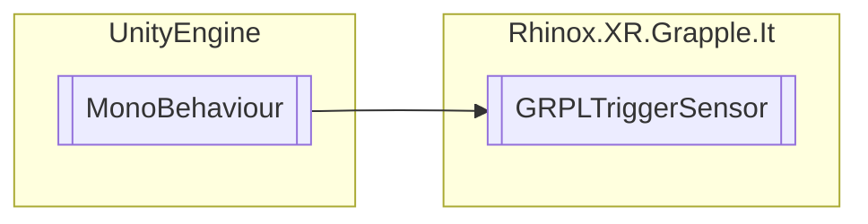

# GRPLTriggerSensor `Public class`

## Description

A simple trigger sensor that detects if a Rhinox hand has entered/exited it.

## Diagram



## Members

### Methods

#### Public  methods

| Returns | Name                                                                                                                                                                                                                                                                 |
|---------|----------------------------------------------------------------------------------------------------------------------------------------------------------------------------------------------------------------------------------------------------------------------|
| `void`  | [`AddListenerOnSensorEnter`](#addlisteneronsensorenter)(`UnityAction` action)<br>A public method that takes a UnityAction parameter and adds it to the OnSensorEnter event's invocation list.<br>            If the event is null, it instantiates a new UnityEvent. |
| `void`  | [`AddListenerOnSensorExit`](#addlisteneronsensorexit)(`UnityAction` action)<br>A public method that takes a UnityAction parameter and adds it to the OnSensorExit event's invocation list.<br>            If the event is null, it instantiates a new UnityEvent.    |
| `void`  | [`InvokeOnSensorEnter`](#invokeonsensorenter)()<br>A public method that invokes the OnSensorEnter event.                                                                                                                                                             |
| `void`  | [`InvokeOnSensorExit`](#invokeonsensorexit)()<br>A public method that invokes the OnSensorExit event.                                                                                                                                                                |
| `void`  | [`RemoveAllListenersOnSensorEnter`](#removealllistenersonsensorenter)()<br>A public method that removes all listeners from the OnSensorEnter event's invocation list.                                                                                                |
| `void`  | [`RemoveAllListenersOnSensorExit`](#removealllistenersonsensorexit)()<br>A public method that removes all listeners from the OnSensorExit event's invocation list.                                                                                                   |
| `void`  | [`RemoveListenerOnSensorEnter`](#removelisteneronsensorenter)(`UnityAction` action)<br>A public method that removes a UnityAction parameter from the OnSensorEnter event's invocation list.                                                                          |
| `void`  | [`RemoveListenerOnSensorExit`](#removelisteneronsensorexit)(`UnityAction` action)<br>A public method that removes a UnityAction parameter from the OnSensorExit event's invocation list.                                                                             |
| `void`  | [`SetIgnoreList`](#setignorelist)(`RhinoxJointCapsule``[]` rhinoxJoinCapsules)<br>A public method that takes an array of RhinoxJointCapsule objects and sets them to be ignored<br>            from triggering the sensor.                                           |

## Details

### Summary

A simple trigger sensor that detects if a Rhinox hand has entered/exited it.

### Remarks

### Inheritance

- `MonoBehaviour`

### Constructors

#### GRPLTriggerSensor

```csharp
public GRPLTriggerSensor()
```

### Methods

#### SetIgnoreList

```csharp
public void SetIgnoreList(RhinoxJointCapsule[] rhinoxJoinCapsules)
```

##### Arguments

| Type                     | Name               | Description                                              |
|--------------------------|--------------------|----------------------------------------------------------|
| `RhinoxJointCapsule``[]` | rhinoxJoinCapsules | Array of RhinoxJointCapsule gotten from GRPLJointManager |

##### Summary

A public method that takes an array of RhinoxJointCapsule objects and sets them to be ignored
from triggering the sensor.

#### AddListenerOnSensorEnter

```csharp
public void AddListenerOnSensorEnter(UnityAction action)
```

##### Arguments

| Type          | Name   | Description             |
|---------------|--------|-------------------------|
| `UnityAction` | action | The UnityAction to add. |

##### Summary

A public method that takes a UnityAction parameter and adds it to the OnSensorEnter event's invocation list.
If the event is null, it instantiates a new UnityEvent.

#### RemoveListenerOnSensorEnter

```csharp
public void RemoveListenerOnSensorEnter(UnityAction action)
```

##### Arguments

| Type          | Name   | Description                |
|---------------|--------|----------------------------|
| `UnityAction` | action | The UnityAction to remove. |

##### Summary

A public method that removes a UnityAction parameter from the OnSensorEnter event's invocation list.

#### RemoveAllListenersOnSensorEnter

```csharp
public void RemoveAllListenersOnSensorEnter()
```

##### Summary

A public method that removes all listeners from the OnSensorEnter event's invocation list.

#### InvokeOnSensorEnter

```csharp
public void InvokeOnSensorEnter()
```

##### Summary

A public method that invokes the OnSensorEnter event.

#### AddListenerOnSensorExit

```csharp
public void AddListenerOnSensorExit(UnityAction action)
```

##### Arguments

| Type          | Name   | Description             |
|---------------|--------|-------------------------|
| `UnityAction` | action | The UnityAction to add. |

##### Summary

A public method that takes a UnityAction parameter and adds it to the OnSensorExit event's invocation list.
If the event is null, it instantiates a new UnityEvent.

#### RemoveListenerOnSensorExit

```csharp
public void RemoveListenerOnSensorExit(UnityAction action)
```

##### Arguments

| Type          | Name   | Description                |
|---------------|--------|----------------------------|
| `UnityAction` | action | The UnityAction to remove. |

##### Summary

A public method that removes a UnityAction parameter from the OnSensorExit event's invocation list.

#### RemoveAllListenersOnSensorExit

```csharp
public void RemoveAllListenersOnSensorExit()
```

##### Summary

A public method that removes all listeners from the OnSensorExit event's invocation list.

#### InvokeOnSensorExit

```csharp
public void InvokeOnSensorExit()
```

##### Summary

A public method that invokes the OnSensorExit event.

*Generated with* [*ModularDoc*](https://github.com/hailstorm75/ModularDoc)
