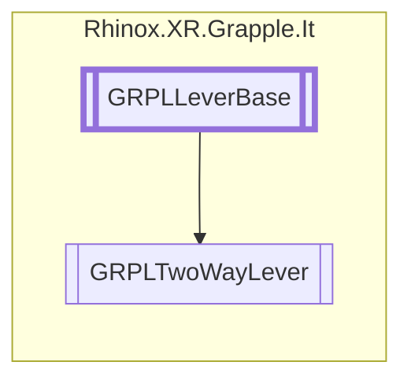

# GRPLTwoWayLever `Public class`

## Description

The GRPLOneWayLever class is a subclass of GRPLLeverBase and provides functionality for two-way levers in a 3D
environment. It has four events (LeverForwardActivated, LeverForwardStopped, LeverBackwardActivated,
LeverBackwardStopped) to notify when the lever is activated or stopped in either direction. It also has some properties
that can be used for debugging. The OnValidate method is used to set the minimum angle that the lever can move, while
the Update method is used to update the lever's rotation and process the current angle.

## Diagram



## Members

### Methods

#### Protected  methods

| Returns | Name                                                                                                                                        |
|---------|---------------------------------------------------------------------------------------------------------------------------------------------|
| `float` | [`GetLeverRotation`](#getleverrotation)(`Vector3` projectedPos)<br>Calculates the angle of the lever based on the projected joint position. |
| `void`  | [`Initialize`](#initialize)()<br>Initializes the lever.                                                                                     |
| `void`  | [`OnDrawGizmos`](#ondrawgizmos)()                                                                                                           |

#### Public  methods

| Returns     | Name                                                                                                                                                                    |
|-------------|-------------------------------------------------------------------------------------------------------------------------------------------------------------------------|
| `bool`      | [`CheckForInteraction`](#checkforinteraction)(`RhinoxJoint` joint, `RhinoxHand` hand)<br>Checks if the given RhinoxJoint and RhinoxHand are interacting with the lever. |
| `Transform` | [`GetReferenceTransform`](#getreferencetransform)()<br>Returns the transform of the handle.                                                                             |
| `bool`      | [`TryGetCurrentInteractJoint`](#trygetcurrentinteractjoint)(`ICollection`&lt;`RhinoxJoint`&gt; joints, out `RhinoxJoint` joint, `RhinoxHand` hand)                      |

## Details

### Summary

The GRPLOneWayLever class is a subclass of GRPLLeverBase and provides functionality for two-way levers in a 3D
environment. It has four events (LeverForwardActivated, LeverForwardStopped, LeverBackwardActivated,
LeverBackwardStopped) to notify when the lever is activated or stopped in either direction. It also has some properties
that can be used for debugging. The OnValidate method is used to set the minimum angle that the lever can move, while
the Update method is used to update the lever's rotation and process the current angle.

### Inheritance

- [
  `GRPLLeverBase`
  ](./rhinoxxrgrappleit-GRPLLeverBase)

### Constructors

#### GRPLTwoWayLever

```csharp
public GRPLTwoWayLever()
```

### Methods

#### Initialize

```csharp
protected override void Initialize()
```

##### Summary

Initializes the lever.

#### GetLeverRotation

```csharp
protected override float GetLeverRotation(Vector3 projectedPos)
```

##### Arguments

| Type      | Name         | Description                  |
|-----------|--------------|------------------------------|
| `Vector3` | projectedPos | The projected joint position |

##### Summary

Calculates the angle of the lever based on the projected joint position.

##### Returns

#### GetReferenceTransform

```csharp
public override Transform GetReferenceTransform()
```

##### Summary

Returns the transform of the handle.

##### Returns

#### CheckForInteraction

```csharp
public override bool CheckForInteraction(RhinoxJoint joint, RhinoxHand hand)
```

##### Arguments

| Type          | Name  | Description                           |
|---------------|-------|---------------------------------------|
| `RhinoxJoint` | joint | The interact joint.                   |
| `RhinoxHand`  | hand  | The hand on which this joint resides. |

##### Summary

Checks if the given RhinoxJoint and RhinoxHand are interacting with the lever.

##### Returns

#### TryGetCurrentInteractJoint

```csharp
public override bool TryGetCurrentInteractJoint(ICollection<RhinoxJoint> joints, out RhinoxJoint joint, RhinoxHand hand)
```

##### Arguments

| Type                               | Name   | Description |
|------------------------------------|--------|-------------|
| `ICollection`&lt;`RhinoxJoint`&gt; | joints |             |
| `out` `RhinoxJoint`                | joint  |             |
| `RhinoxHand`                       | hand   |             |

#### OnDrawGizmos

```csharp
protected override void OnDrawGizmos()
```

### Events

#### LeverForwardActivated

```csharp
public event Action<GRPLTwoWayLever> LeverForwardActivated
```

##### Summary

An event that is raised when the lever is activated in the forward direction.

#### LeverForwardStopped

```csharp
public event Action<GRPLTwoWayLever> LeverForwardStopped
```

##### Summary

An event that is raised when the lever is stopped in the forward direction.

#### LeverBackwardActivated

```csharp
public event Action<GRPLTwoWayLever> LeverBackwardActivated
```

##### Summary

An event that is raised when the lever is activated in the backward direction.

#### LeverBackwardStopped

```csharp
public event Action<GRPLTwoWayLever> LeverBackwardStopped
```

##### Summary

An event that is raised when the lever is stopped in the backward direction.

*Generated with* [*ModularDoc*](https://github.com/hailstorm75/ModularDoc)
