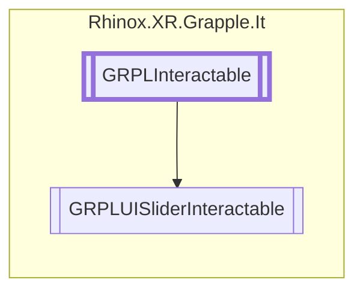

# GRPLUISliderInteractable `Public class`

## Description

This class represents an interactable slider. It derives from
GRPLInteractable, and it contains properties and methods to handle interaction with a hands. It also
extends the basic functionality of a Unity Slider component to add hand tracking specific features.

## Diagram



## Members

### Properties

#### Public  properties

| Type    | Name                                                                                            | Methods |
|---------|-------------------------------------------------------------------------------------------------|---------|
| `float` | [`SliderValue`](#slidervalue)<br>A float property that returns the current value of the slider. | `get`   |

### Methods

#### Protected  methods

| Returns | Name                                                                                                          |
|---------|---------------------------------------------------------------------------------------------------------------|
| `void`  | [`Initialize`](#initialize)()<br>This method initializes the slider's components and sets its initial values. |
| `void`  | [`InteractStarted`](#interactstarted)()                                                                       |

#### Public  methods

| Returns     | Name                                                                                                                                                                                                                                                                    |
|-------------|-------------------------------------------------------------------------------------------------------------------------------------------------------------------------------------------------------------------------------------------------------------------------|
| `bool`      | [`CheckForInteraction`](#checkforinteraction)(`RhinoxJoint` joint, `RhinoxHand` hand)<br>This method checks whether a given RhinoxJoint is interacting with the slider.<br>            It returns a boolean value that indicates whether the interaction is successful. |
| `Transform` | [`GetReferenceTransform`](#getreferencetransform)()<br>This method returns the Transform component of the slider's handle.                                                                                                                                              |
| `bool`      | [`ShouldInteractionCheckStop`](#shouldinteractioncheckstop)()                                                                                                                                                                                                           |
| `bool`      | [`TryGetCurrentInteractJoint`](#trygetcurrentinteractjoint)(`ICollection`&lt;`RhinoxJoint`&gt; joints, out `RhinoxJoint` outJoint, `RhinoxHand` hand)                                                                                                                   |

## Details

### Summary

This class represents an interactable slider. It derives from
GRPLInteractable, and it contains properties and methods to handle interaction with a hands. It also
extends the basic functionality of a Unity Slider component to add hand tracking specific features.

### Remarks

### Inheritance

- [
  `GRPLInteractable`
  ](./rhinoxxrgrappleit-GRPLInteractable)

### Constructors

#### GRPLUISliderInteractable

```csharp
public GRPLUISliderInteractable()
```

### Methods

#### Initialize

```csharp
protected override void Initialize()
```

##### Summary

This method initializes the slider's components and sets its initial values.

#### GetReferenceTransform

```csharp
public override Transform GetReferenceTransform()
```

##### Summary

This method returns the Transform component of the slider's handle.

##### Returns

The Transform component of the slider's handle.

#### CheckForInteraction

```csharp
public override bool CheckForInteraction(RhinoxJoint joint, RhinoxHand hand)
```

##### Arguments

| Type          | Name  | Description                          |
|---------------|-------|--------------------------------------|
| `RhinoxJoint` | joint | The interaction joint.               |
| `RhinoxHand`  | hand  | The hand on which this joint resides |

##### Summary

This method checks whether a given RhinoxJoint is interacting with the slider.
It returns a boolean value that indicates whether the interaction is successful.

##### Returns

Whether the interaction is successful

#### TryGetCurrentInteractJoint

```csharp
public override bool TryGetCurrentInteractJoint(ICollection<RhinoxJoint> joints, out RhinoxJoint outJoint, RhinoxHand hand)
```

##### Arguments

| Type                               | Name     | Description |
|------------------------------------|----------|-------------|
| `ICollection`&lt;`RhinoxJoint`&gt; | joints   |             |
| `out` `RhinoxJoint`                | outJoint |             |
| `RhinoxHand`                       | hand     |             |

#### ShouldInteractionCheckStop

```csharp
public override bool ShouldInteractionCheckStop()
```

#### InteractStarted

```csharp
protected override void InteractStarted()
```

### Properties

#### SliderValue

```csharp
public float SliderValue { get; }
```

##### Summary

A float property that returns the current value of the slider.

### Events

#### OnValueUpdate

```csharp
public event Action<float> OnValueUpdate
```

##### Summary

An event that is triggered whenever the slider's value is updated.

*Generated with* [*ModularDoc*](https://github.com/hailstorm75/ModularDoc)
