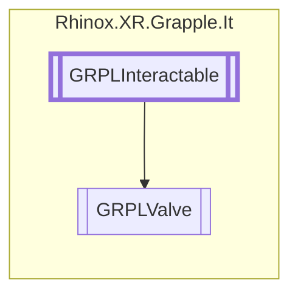

# GRPLValve `Public class`

## Description

This class represents a valve that can be interacted with in a hand tracking context.
It extends the [GRPLInteractable](./rhinoxxrgrappleit-GRPLInteractable) class.

## Diagram



## Members

### Properties

#### Public  properties

| Type    | Name                                                                               | Methods              |
|---------|------------------------------------------------------------------------------------|----------------------|
| `float` | [`CurrentValveRotation`](#currentvalverotation)<br>The current angle of the valve. | `get`                |
| `bool`  | [`IsGrabbed`](#isgrabbed)<br>Whether or not the valve is currently being grabbed.  | `get, protected set` |

### Methods

#### Protected  methods

| Returns | Name                                                                                                                                                                                 |
|---------|--------------------------------------------------------------------------------------------------------------------------------------------------------------------------------------|
| `void`  | [`Awake`](#awake)()<br>Sets _forceInteractibleJoint to true and sets the correct _forcedInteractJointID.                                                                             |
| `void`  | [`Initialize`](#initialize)()<br>This method initializes the valve's rotation, minimum and maximum grab radii and checks if the<br>            visualTransform variable is not null. |
| `void`  | [`InteractStopped`](#interactstopped)()                                                                                                                                              |
| `void`  | [`OnDisable`](#ondisable)()<br>Unsubscribes the needed events.                                                                                                                       |
| `void`  | [`OnDrawGizmos`](#ondrawgizmos)()                                                                                                                                                    |
| `void`  | [`OnEnable`](#onenable)()<br>Subscribes the needed events.                                                                                                                           |

#### Public  methods

| Returns | Name                                                                                                                                                                                                                                                             |
|---------|------------------------------------------------------------------------------------------------------------------------------------------------------------------------------------------------------------------------------------------------------------------|
| `bool`  | [`CheckForInteraction`](#checkforinteraction)(`RhinoxJoint` joint, `RhinoxHand` hand)<br>This method checks if a joint is within range of the valve and if it is in a proper gesture state to grab<br>            the valve. If so, it returns true, else false. |
| `bool`  | [`TryGetCurrentInteractJoint`](#trygetcurrentinteractjoint)(`ICollection`&lt;`RhinoxJoint`&gt; joints, out `RhinoxJoint` outJoint, `RhinoxHand` hand)                                                                                                            |
| `void`  | [`TryGrab`](#trygrab)(`RhinoxHand` hand)<br>Function that allows external code to grab the valve if given hand is in range.                                                                                                                                      |
| `void`  | [`TryLetGo`](#tryletgo)(`RhinoxHand` hand)<br>Function that allows external code to grab the valve if given hand is the hand that is interacting with it.                                                                                                        |

## Details

### Summary

This class represents a valve that can be interacted with in a hand tracking context.
It extends the [GRPLInteractable](./rhinoxxrgrappleit-GRPLInteractable) class.

### Remarks

Only one hand can interact with it at the same time. Turning the valve clockwise is considered to be closing the valve.
Turning the valve counter-clockwise is considered to be opening the valve.

### Inheritance

- [
  `GRPLInteractable`
  ](./rhinoxxrgrappleit-GRPLInteractable)

### Constructors

#### GRPLValve

```csharp
public GRPLValve()
```

### Methods

#### Awake

```csharp
protected void Awake()
```

##### Summary

Sets _forceInteractibleJoint to true and sets the correct _forcedInteractJointID.

#### Initialize

```csharp
protected override void Initialize()
```

##### Summary

This method initializes the valve's rotation, minimum and maximum grab radii and checks if the
visualTransform variable is not null.

#### OnEnable

```csharp
protected override void OnEnable()
```

##### Summary

Subscribes the needed events.

#### OnDisable

```csharp
protected override void OnDisable()
```

##### Summary

Unsubscribes the needed events.

#### CheckForInteraction

```csharp
public override bool CheckForInteraction(RhinoxJoint joint, RhinoxHand hand)
```

##### Arguments

| Type          | Name  | Description                          |
|---------------|-------|--------------------------------------|
| `RhinoxJoint` | joint | The interaction joint.               |
| `RhinoxHand`  | hand  | The hand on which this joint resides |

##### Summary

This method checks if a joint is within range of the valve and if it is in a proper gesture state to grab
the valve. If so, it returns true, else false.

##### Returns

Whether the interaction is successful

#### TryGetCurrentInteractJoint

```csharp
public override bool TryGetCurrentInteractJoint(ICollection<RhinoxJoint> joints, out RhinoxJoint outJoint, RhinoxHand hand)
```

##### Arguments

| Type                               | Name     | Description |
|------------------------------------|----------|-------------|
| `ICollection`&lt;`RhinoxJoint`&gt; | joints   |             |
| `out` `RhinoxJoint`                | outJoint |             |
| `RhinoxHand`                       | hand     |             |

#### InteractStopped

```csharp
protected override void InteractStopped()
```

#### TryGrab

```csharp
public void TryGrab(RhinoxHand hand)
```

##### Arguments

| Type         | Name | Description                                                     |
|--------------|------|-----------------------------------------------------------------|
| `RhinoxHand` | hand | The hand that will be used to grab and interact with the valve. |

##### Summary

Function that allows external code to grab the valve if given hand is in range.

#### TryLetGo

```csharp
public void TryLetGo(RhinoxHand hand)
```

##### Arguments

| Type         | Name | Description                                      |
|--------------|------|--------------------------------------------------|
| `RhinoxHand` | hand | The hand that should try to let go of the valve. |

##### Summary

Function that allows external code to grab the valve if given hand is the hand that is interacting with it.

#### OnDrawGizmos

```csharp
protected override void OnDrawGizmos()
```

### Properties

#### IsGrabbed

```csharp
public bool IsGrabbed { get; protected set; }
```

##### Summary

Whether or not the valve is currently being grabbed.

#### CurrentValveRotation

```csharp
public float CurrentValveRotation { get; }
```

##### Summary

The current angle of the valve.

*Generated with* [*ModularDoc*](https://github.com/hailstorm75/ModularDoc)
