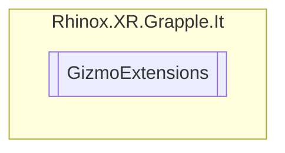

# GizmoExtensions `Public class`

## Description

This utility class provides extension methods for drawing various geometrical shapes as gizmos.

## Diagram



## Members

### Methods

#### Public Static methods

| Returns | Name                                                                                                                                                                                                                                                         |
|---------|--------------------------------------------------------------------------------------------------------------------------------------------------------------------------------------------------------------------------------------------------------------|
| `void`  | [`DrawSolidAnnulus`](#drawsolidannulus)(`Vector3` center, `Vector3` direction, `Vector3` forwardVec, `float` innerR, `float` outerR, `bool` force2Sided, `int` segments)<br>Draws a solid annulus arc (a solid ring segment) using Gizmos in the scene view. |
| `void`  | [`DrawSolidAnnulusArc`](#drawsolidannulusarc)(`Vector3` center, `Vector3` direction, `Vector3` forwardVec, `float` innerR, `float` outerR, `float` angle, `bool` force2Sided, `int` segments)<br>Draws a filled Annulus (2D flat donut) arc in 3D space.     |
| `void`  | [`DrawSolidAnnulusWidth`](#drawsolidannuluswidth)(`Vector3` center, `Vector3` direction, `Vector3` forwardVec, `float` centerR, `float` halfWidth, `bool` force2Sided, `int` segments)<br>Draws a filled Annulus (2D flat donut) in 3D space.                |
| `void`  | [`DrawSolidArc`](#drawsolidarc)(`Vector3` arcCenter, `Vector3` direction, `Vector3` arcNormal, `float` arcRadius, `float` arcAngle, `bool` force2Sided, `int` segments)<br>Draws a solid arc using Gizmos in the scene view.                                 |
| `void`  | [`DrawSolidCircle`](#drawsolidcircle)(`Vector3` circleCenter, `Vector3` direction, `Vector3` circleNormal, `float` circleRadius, `bool` force2Sided, `int` segments)<br>Draw a filled circle gizmo in 3D space.                                              |
| `void`  | [`DrawSolidTorus`](#drawsolidtorus)(`Vector3` center, `Vector3` direction, `Vector3` forwardVec, `float` innerR, `float` outerR, `int` segmentsInner, `int` segmentsOuter)<br>Draws a solid torus using Gizmos in the scene view.                            |
| `void`  | [`DrawWireArc`](#drawwirearc)(`Vector3` arcCenter, `Vector3` direction, `Vector3` arcNormal, `float` arcRadius, `float` arcAngle, `int` segments)<br>This method draws a wireframe arc using Gizmos in the scene view                                        |
| `void`  | [`DrawWireCircle`](#drawwirecircle)(`Vector3` circleCenter, `Vector3` direction, `Vector3` circleNormal, `float` circleRadius, `int` segments)<br>Draws a wireframe circle using Gizmos in the scene view.                                                   |
| `void`  | [`DrawWireTorus`](#drawwiretorus)(`Vector3` center, `Vector3` direction, `Vector3` forwardVec, `float` innerR, `float` outerR, `int` segmentsInner, `int` segmentsOuter)<br>Draws a wire torus using Gizmos in the scene view.                               |

## Details

### Summary

This utility class provides extension methods for drawing various geometrical shapes as gizmos.

### Methods

#### DrawWireArc

```csharp
public static void DrawWireArc(Vector3 arcCenter, Vector3 direction, Vector3 arcNormal, float arcRadius, float arcAngle, int segments)
```

##### Arguments

| Type      | Name      | Description                                                                 |
|-----------|-----------|-----------------------------------------------------------------------------|
| `Vector3` | arcCenter | The center point of the arc                                                 |
| `Vector3` | direction | The initial direction in which the arc will be drawn.                       |
| `Vector3` | arcNormal | A perpendicular vector to the plane in which the arc lies.                  |
| `float`   | arcRadius | The radius of the arc.                                                      |
| `float`   | arcAngle  | Specifies the angle, in degrees, that the arc spans.                        |
| `int`     | segments  | Specifies the number of line segments used to draw the arc (default is 10). |

##### Summary

This method draws a wireframe arc using Gizmos in the scene view

##### Remarks

The `direction` and `arcNormal` should be normalized otherwise the circle will be drawn incorrectly.

#### DrawSolidArc

```csharp
public static void DrawSolidArc(Vector3 arcCenter, Vector3 direction, Vector3 arcNormal, float arcRadius, float arcAngle, bool force2Sided, int segments)
```

##### Arguments

| Type      | Name        | Description                                                                                                    |
|-----------|-------------|----------------------------------------------------------------------------------------------------------------|
| `Vector3` | arcCenter   | The center point of the arc                                                                                    |
| `Vector3` | direction   | The initial direction in which the arc will be drawn.                                                          |
| `Vector3` | arcNormal   | A perpendicular vector to the plane in which the arc lies.                                                     |
| `float`   | arcRadius   | The radius of the arc.                                                                                         |
| `float`   | arcAngle    | Specifies the angle, in degrees, that the arc spans.                                                           |
| `bool`    | force2Sided | Optional parameter specifying if the arc will be visible from both sides of the normal (basically no culling). |
| `int`     | segments    | Specifies the number of line segments used to draw the arc (default is 10).                                    |

##### Summary

Draws a solid arc using Gizmos in the scene view.

##### Remarks

The `direction` and `arcNormal` should be normalized otherwise the circle will be drawn incorrectly.

#### DrawWireCircle

```csharp
public static void DrawWireCircle(Vector3 circleCenter, Vector3 direction, Vector3 circleNormal, float circleRadius, int segments)
```

##### Arguments

| Type      | Name         | Description                                                                 |
|-----------|--------------|-----------------------------------------------------------------------------|
| `Vector3` | circleCenter | The center point of the circle in world space.                              |
| `Vector3` | direction    | Specifies the initial direction in which the circle is drawn.               |
| `Vector3` | circleNormal | A perpendicular vector to the plane in which the circle lies.               |
| `float`   | circleRadius | The radius of the circle.                                                   |
| `int`     | segments     | Specifies the number of line segments used to draw the arc (default is 10). |

##### Summary

Draws a wireframe circle using Gizmos in the scene view.

##### Remarks

The `direction` and `circleNormal` should be normalized otherwise the circle will be drawn incorrectly.

#### DrawSolidCircle

```csharp
public static void DrawSolidCircle(Vector3 circleCenter, Vector3 direction, Vector3 circleNormal, float circleRadius, bool force2Sided, int segments)
```

##### Arguments

| Type      | Name         | Description                                                                                                       |
|-----------|--------------|-------------------------------------------------------------------------------------------------------------------|
| `Vector3` | circleCenter | The center point of the circle in world space.                                                                    |
| `Vector3` | direction    | Specifies the initial direction in which the circle is drawn.                                                     |
| `Vector3` | circleNormal | A perpendicular vector to the plane in which the circle lies.                                                     |
| `float`   | circleRadius | The radius of the circle.                                                                                         |
| `bool`    | force2Sided  | Optional parameter specifying if the circle will be visible from both sides of the normal (basically no culling). |
| `int`     | segments     | Specifies the number of line segments used to draw the arc (default is 10).                                       |

##### Summary

Draw a filled circle gizmo in 3D space.

##### Remarks

The `direction` and `circleNormal` should be normalized otherwise the circle will be drawn incorrectly.

#### DrawSolidAnnulusArc

```csharp
public static void DrawSolidAnnulusArc(Vector3 center, Vector3 direction, Vector3 forwardVec, float innerR, float outerR, float angle, bool force2Sided, int segments)
```

##### Arguments

| Type      | Name        | Description                                                                                                        |
|-----------|-------------|--------------------------------------------------------------------------------------------------------------------|
| `Vector3` | center      | The center point of the annulus arc in world space.                                                                |
| `Vector3` | direction   | The direction of where the annulus arc start point is.                                                             |
| `Vector3` | forwardVec  | The normal of the plane the annulus is on.                                                                         |
| `float`   | innerR      | The radius of the annulus's inner border.                                                                          |
| `float`   | outerR      | The radius of the annulus's outer border.                                                                          |
| `float`   | angle       | The angle of the annulus arc in degrees.                                                                           |
| `bool`    | force2Sided | Optional parameter specifying if the annulus will be visible from both sides of the normal (basically no culling). |
| `int`     | segments    | Specifies the number of line segments used to draw the arc (default is 12).                                        |

##### Summary

Draws a filled Annulus (2D flat donut) arc in 3D space.

##### Remarks

DOES NOT DO ARC, STILL CLOSES The `direction` and `forwardVec` should be normalized otherwise the circle will be drawn
incorrectly. `segments` cannot go below 3, as 3 is the minimum to make a triangle.

#### DrawSolidAnnulus

```csharp
public static void DrawSolidAnnulus(Vector3 center, Vector3 direction, Vector3 forwardVec, float innerR, float outerR, bool force2Sided, int segments)
```

##### Arguments

| Type      | Name        | Description                                                                                                        |
|-----------|-------------|--------------------------------------------------------------------------------------------------------------------|
| `Vector3` | center      | The center point of the annulus in world space.                                                                    |
| `Vector3` | direction   | The initial direction in which the annulus is drawn.                                                               |
| `Vector3` | forwardVec  | A vector that defines the plane in which the annulus lies.                                                         |
| `float`   | innerR      | The radius of the annulus's inner border.                                                                          |
| `float`   | outerR      | The radius of the annulus's outer border.                                                                          |
| `bool`    | force2Sided | Optional parameter specifying if the annulus will be visible from both sides of the normal (basically no culling). |
| `int`     | segments    | Specifies the number of line segments used to draw the arc (default is 12).                                        |

##### Summary

Draws a solid annulus arc (a solid ring segment) using Gizmos in the scene view.

##### Remarks

The `direction` and `forwardVec` should be normalized otherwise the circle will be drawn incorrectly.

#### DrawSolidAnnulusWidth

```csharp
public static void DrawSolidAnnulusWidth(Vector3 center, Vector3 direction, Vector3 forwardVec, float centerR, float halfWidth, bool force2Sided, int segments)
```

##### Arguments

| Type      | Name        | Description                                                                                                        |
|-----------|-------------|--------------------------------------------------------------------------------------------------------------------|
| `Vector3` | center      | The center point of the annulus in worldspace.                                                                     |
| `Vector3` | direction   | The initial direction in which the annulus is drawn.                                                               |
| `Vector3` | forwardVec  | A vector that defines the plane in which the annulus lies.                                                         |
| `float`   | centerR     | The radius of the annulus's.                                                                                       |
| `float`   | halfWidth   | The half width of the filled part of annulus.                                                                      |
| `bool`    | force2Sided | Optional parameter specifying if the annulus will be visible from both sides of the normal (basically no culling). |
| `int`     | segments    | Specifies the number of line segments used to draw the arc (default is 12).                                        |

##### Summary

Draws a filled Annulus (2D flat donut) in 3D space.

##### Remarks

The `direction` and `forwardVec` should be normalized otherwise the circle will be drawn incorrectly.

#### DrawSolidTorus

```csharp
public static void DrawSolidTorus(Vector3 center, Vector3 direction, Vector3 forwardVec, float innerR, float outerR, int segmentsInner, int segmentsOuter)
```

##### Arguments

| Type      | Name          | Description                                                                                                                           |
|-----------|---------------|---------------------------------------------------------------------------------------------------------------------------------------|
| `Vector3` | center        | The center point of the torus in worlds pace.                                                                                         |
| `Vector3` | direction     | The direction of where the torus start point is.                                                                                      |
| `Vector3` | forwardVec    | The normal of the plane the torus is on.                                                                                              |
| `float`   | innerR        | The radius of the annulus's inner border.                                                                                             |
| `float`   | outerR        | The radius of the annulus's outer border.                                                                                             |
| `int`     | segmentsInner | Optional parameter specifying the number of line segments that will be used to draw <br>            the loop around the given normal. |
| `int`     | segmentsOuter | Optional parameter specifying the number of line segments that will be used to draw <br>            the loop of each segment.         |

##### Summary

Draws a solid torus using Gizmos in the scene view.

##### Remarks

The `direction` and `forwardVec` should be normalized otherwise the circle will be drawn incorrectly. `segmentsInner`
and `segmentsOuter` cannot go below 3, as 3 is the minimum to make a triangle.

#### DrawWireTorus

```csharp
public static void DrawWireTorus(Vector3 center, Vector3 direction, Vector3 forwardVec, float innerR, float outerR, int segmentsInner, int segmentsOuter)
```

##### Arguments

| Type      | Name          | Description                                                                                                                           |
|-----------|---------------|---------------------------------------------------------------------------------------------------------------------------------------|
| `Vector3` | center        | The center point of the torus in worlds pace.                                                                                         |
| `Vector3` | direction     | The direction of where the torus start point is.                                                                                      |
| `Vector3` | forwardVec    | The normal of the plane the torus is on.                                                                                              |
| `float`   | innerR        | The radius of the annulus's inner border.                                                                                             |
| `float`   | outerR        | The radius of the annulus's outer border.                                                                                             |
| `int`     | segmentsInner | Optional parameter specifying the number of line segments that will be used to draw <br>            the loop around the given normal. |
| `int`     | segmentsOuter | Optional parameter specifying the number of line segments that will be used to draw <br>            the loop of each segment.         |

##### Summary

Draws a wire torus using Gizmos in the scene view.

##### Remarks

The `direction` and `forwardVec` should be normalized otherwise the circle will be drawn incorrectly. `segmentsInner`
and `segmentsOuter` cannot go below 3, as 3 is the minimum to make a triangle.

*Generated with* [*ModularDoc*](https://github.com/hailstorm75/ModularDoc)
