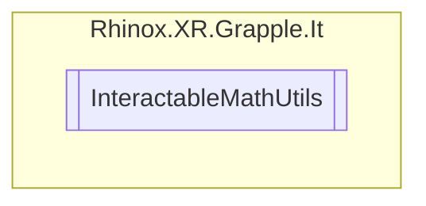

# InteractableMathUtils `Public class`

## Description

A static class that contains useful 3D math functions for working with interactable objects.

## Diagram



## Members

### Methods

#### Public Static methods

| Returns   | Name                                                                                                                                                                                                                                                                                                                    |
|-----------|-------------------------------------------------------------------------------------------------------------------------------------------------------------------------------------------------------------------------------------------------------------------------------------------------------------------------|
| `float`   | [`GetProjectedDistanceFromPointOnNormal`](#getprojecteddistancefrompointonnormal)(`Vector3` projectPoint, `Vector3` normalPoint, `Vector3` normal)<br>Calculates the projected distance of point "projectPoint" and "normalPoint" along the normal vector "normal".                                                     |
| `bool`    | [`IsPlaneProjectedPointInBounds`](#isplaneprojectedpointinbounds)(`Vector3` point, `Vector3` planePosition, `Vector3` planeNormal, `Bounds` bounds)<br>Checks whether the projected position of the given point on the plane (defined by<br>            the planePosition and PlaneForward) is within the given bounds. |
| `bool`    | [`IsPointCloserThanOtherPoint`](#ispointcloserthanotherpoint)(`Vector3` referencePoint, `Vector3` p1, `Vector3` p2)<br>Checks if point p1 is closer to the interactible than point p2.                                                                                                                                  |
| `bool`    | [`IsPositionInFrontOfPlane`](#ispositioninfrontofplane)(`Vector3` pos, `Vector3` planePosition, `Vector3` planeNormal)<br>Checks if the given position is in front of given plane. The plane is defined with a point and forward vector.                                                                                |
| `Vector3` | [`ProjectOnPlaneAndTranslate`](#projectonplaneandtranslate)(`Vector3` point, `Vector3` planePosition, `Vector3` planeNormal)<br>Projects the given point onto a plane defined by a position and normal vector, and then translates the result by the position of the plane.                                             |

## Details

### Summary

A static class that contains useful 3D math functions for working with interactable objects.

### Methods

#### ProjectOnPlaneAndTranslate

```csharp
public static Vector3 ProjectOnPlaneAndTranslate(Vector3 point, Vector3 planePosition, Vector3 planeNormal)
```

##### Arguments

| Type      | Name          | Description                             |
|-----------|---------------|-----------------------------------------|
| `Vector3` | point         | The point to project.                   |
| `Vector3` | planePosition | A point on the desired plane.           |
| `Vector3` | planeNormal   | The normal vector of the desired plane. |

##### Summary

Projects the given point onto a plane defined by a position and normal vector, and then translates the result by the
position of the plane.

##### Returns

The projected point, translated by the position of the plane.

#### IsPositionInFrontOfPlane

```csharp
public static bool IsPositionInFrontOfPlane(Vector3 pos, Vector3 planePosition, Vector3 planeNormal)
```

##### Arguments

| Type      | Name          | Description                     |
|-----------|---------------|---------------------------------|
| `Vector3` | pos           | The position to check           |
| `Vector3` | planePosition | A point on the desired plane    |
| `Vector3` | planeNormal   | The normal of the desired plane |

##### Summary

Checks if the given position is in front of given plane. The plane is defined with a point and forward vector.

##### Returns

#### IsPlaneProjectedPointInBounds

```csharp
public static bool IsPlaneProjectedPointInBounds(Vector3 point, Vector3 planePosition, Vector3 planeNormal, Bounds bounds)
```

##### Arguments

| Type      | Name          | Description                     |
|-----------|---------------|---------------------------------|
| `Vector3` | point         | The point to project.           |
| `Vector3` | planePosition | A point on the desired plane    |
| `Vector3` | planeNormal   | The normal of the desired plane |
| `Bounds`  | bounds        | The bounds to check             |

##### Summary

Checks whether the projected position of the given point on the plane (defined by
the planePosition and PlaneForward) is within the given bounds.

##### Returns

#### GetProjectedDistanceFromPointOnNormal

```csharp
public static float GetProjectedDistanceFromPointOnNormal(Vector3 projectPoint, Vector3 normalPoint, Vector3 normal)
```

##### Arguments

| Type      | Name         | Description                              |
|-----------|--------------|------------------------------------------|
| `Vector3` | projectPoint | The point to project                     |
| `Vector3` | normalPoint  | The reference point on the normal vector |
| `Vector3` | normal       | The normal vector to project on          |

##### Summary

Calculates the projected distance of point "projectPoint" and "normalPoint" along the normal vector "normal".

##### Returns

A scalar float value representing the projected distance

#### IsPointCloserThanOtherPoint

```csharp
public static bool IsPointCloserThanOtherPoint(Vector3 referencePoint, Vector3 p1, Vector3 p2)
```

##### Arguments

| Type      | Name           | Description      |
|-----------|----------------|------------------|
| `Vector3` | referencePoint | The main point   |
| `Vector3` | p1             | The first point  |
| `Vector3` | p2             | The second point |

##### Summary

Checks if point p1 is closer to the interactible than point p2.

##### Returns

A boolean representing whether the point is closer or not.

*Generated with* [*ModularDoc*](https://github.com/hailstorm75/ModularDoc)
