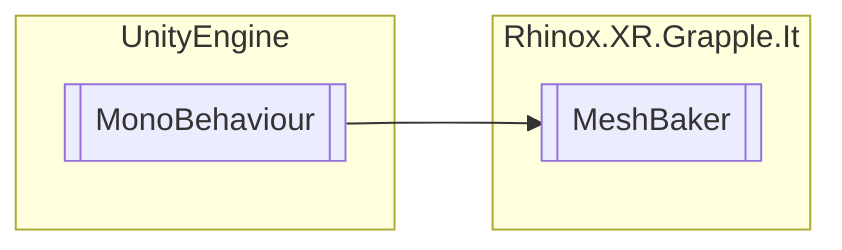

# MeshBaker `Public class`

## Description

This component contains functionality to bake a mesh.

## Diagram



## Members

### Methods

#### Public  methods

| Returns | Name                                                                                                                                                                                                                                                                                                  |
|---------|-------------------------------------------------------------------------------------------------------------------------------------------------------------------------------------------------------------------------------------------------------------------------------------------------------|
| `void`  | [`BakeMesh`](#bakemesh)(`RhinoxHand` hand, `bool` disableRenderer)<br>Bakes the meshes for the given hand. If disableRenderer is true, the original hand will not be rendered.                                                                                                                        |
| `void`  | [`BakeMeshAndParentToTransform`](#bakemeshandparenttotransform)(`RhinoxHand` hand, `Transform` parent, `bool` disableRenderer)<br>Bakes the meshes for the given hand and parents them to the specified Transform.<br>            If disableRenderer is true, the original hand will not be rendered. |
| `void`  | [`DestroyBakedObjects`](#destroybakedobjects)(`RhinoxHand` hand)<br>Destroys all baked meshes for the given hand on this MeshBaker.                                                                                                                                                                   |

## Details

### Summary

This component contains functionality to bake a mesh.

### Inheritance

- `MonoBehaviour`

### Constructors

#### MeshBaker

```csharp
public MeshBaker()
```

### Methods

#### BakeMesh

```csharp
public void BakeMesh(RhinoxHand hand, bool disableRenderer)
```

##### Arguments

| Type         | Name            | Description                                                                   |
|--------------|-----------------|-------------------------------------------------------------------------------|
| `RhinoxHand` | hand            | The hand to bake.                                                             |
| `bool`       | disableRenderer | Optional parameter to specify if the original hand should continue rendering. |

##### Summary

Bakes the meshes for the given hand. If disableRenderer is true, the original hand will not be rendered.

#### BakeMeshAndParentToTransform

```csharp
public void BakeMeshAndParentToTransform(RhinoxHand hand, Transform parent, bool disableRenderer)
```

##### Arguments

| Type         | Name            | Description                                                                   |
|--------------|-----------------|-------------------------------------------------------------------------------|
| `RhinoxHand` | hand            | The hand to bake.                                                             |
| `Transform`  | parent          | The transform to parent the baked mesh to.                                    |
| `bool`       | disableRenderer | Optional parameter to specify if the original hand should continue rendering. |

##### Summary

Bakes the meshes for the given hand and parents them to the specified Transform.
If disableRenderer is true, the original hand will not be rendered.

#### DestroyBakedObjects

```csharp
public void DestroyBakedObjects(RhinoxHand hand)
```

##### Arguments

| Type         | Name | Description |
|--------------|------|-------------|
| `RhinoxHand` | hand |             |

##### Summary

Destroys all baked meshes for the given hand on this MeshBaker.

*Generated with* [*ModularDoc*](https://github.com/hailstorm75/ModularDoc)
