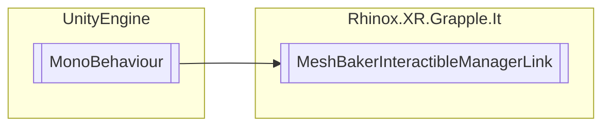

# MeshBakerInteractibleManagerLink `Public class`

## Description

Links the [GRPLInteractableManager](./rhinoxxrgrappleit-GRPLInteractableManager) to
the [MeshBaker](./rhinoxxrgrappleit-MeshBaker) component. This script is used to bake the current
mesh when the [GRPLInteractableManager](./rhinoxxrgrappleit-GRPLInteractableManager) freezes an interaction check. It
subscribes to events from the [GRPLInteractableManager](./rhinoxxrgrappleit-GRPLInteractableManager) to pause and
resume interactables, and to track interactables that are currently paused. The class also provides a default bake
option for cases where the [GRPLInteractableBakeSettings](./rhinoxxrgrappleit-GRPLInteractableBakeSettings) component
is not
found. When an interactible is paused, the script uses the bake option specified in the
interactables [GRPLInteractableBakeSettings](./rhinoxxrgrappleit-GRPLInteractableBakeSettings) component to bake the
mesh using the [MeshBaker](./rhinoxxrgrappleit-MeshBaker) component. When the interactible is
resumed or left proximity, the baked mesh is destroyed.

## Diagram



## Details

### Summary

Links the [GRPLInteractableManager](./rhinoxxrgrappleit-GRPLInteractableManager) to
the [MeshBaker](./rhinoxxrgrappleit-MeshBaker) component. This script is used to bake the current
mesh when the [GRPLInteractableManager](./rhinoxxrgrappleit-GRPLInteractableManager) freezes an interaction check. It
subscribes to events from the [GRPLInteractableManager](./rhinoxxrgrappleit-GRPLInteractableManager) to pause and
resume interactables, and to track interactables that are currently paused. The class also provides a default bake
option for cases where the [GRPLInteractableBakeSettings](./rhinoxxrgrappleit-GRPLInteractableBakeSettings) component
is not
found. When an interactible is paused, the script uses the bake option specified in the
interactables [GRPLInteractableBakeSettings](./rhinoxxrgrappleit-GRPLInteractableBakeSettings) component to bake the
mesh using the [MeshBaker](./rhinoxxrgrappleit-MeshBaker) component. When the interactible is
resumed or left proximity, the baked mesh is destroyed.

### Inheritance

- `MonoBehaviour`

### Constructors

#### MeshBakerInteractibleManagerLink

```csharp
public MeshBakerInteractibleManagerLink()
```

*Generated with* [*ModularDoc*](https://github.com/hailstorm75/ModularDoc)
