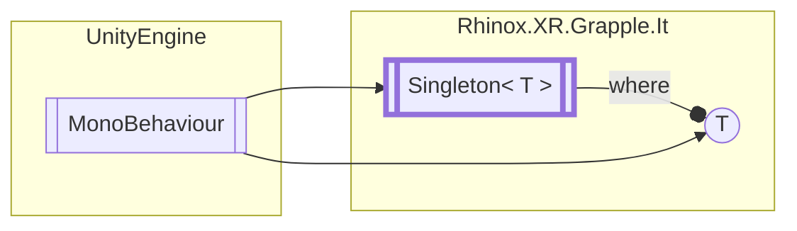

# Singleton&lt;T&gt; `Public class`

## Diagram



## Details

### Inheritance

- `MonoBehaviour`

### Constructors

#### Singleton

```csharp
protected Singleton()
```

*Generated with* [*ModularDoc*](https://github.com/hailstorm75/ModularDoc)
