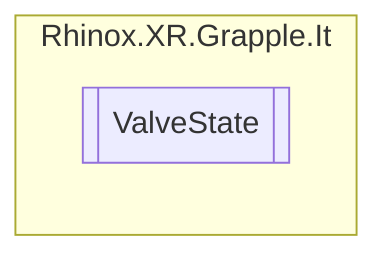

# ValveState `Public enum`

## Description

The possible states the [GRPLValve](./rhinoxxrgrappleit-GRPLValve) can be in.

## Diagram

## Details

### Summary

The possible states the [GRPLValve](./rhinoxxrgrappleit-GRPLValve) can be in.

### Fields

#### GreyZone

##### Summary

The neutral state of a valve. This means that the valve is in the inbetween state of fully opened and fully closed.

#### FullyOpen

##### Summary

The valve is in this state when the valve is in fully opened.

#### FullyClosed

##### Summary

The valve is in this state when the valve is in fully closed.

*Generated with* [*ModularDoc*](https://github.com/hailstorm75/ModularDoc)
